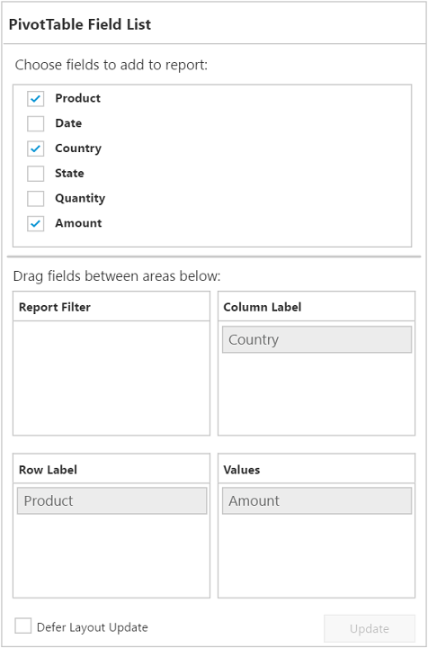

# Defer Update

I> This feature is applicable for Relational datasource only at Server Mode.

Defer Update support allows you to refresh the control only on-demand and not during every UI interaction.



    

    

  


 

