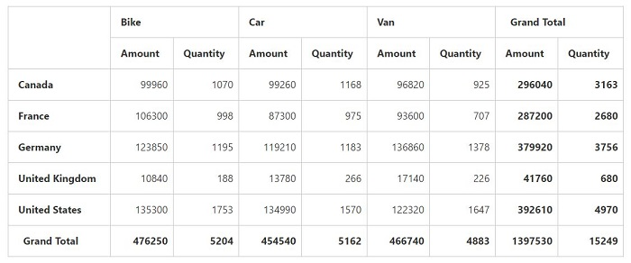

# Value Sorting

I> This feature is applicable for Relational datasource only at Client Mode.

Value Sorting allows to sort columns and rows based on value fields.

The headers of the column to be sorted is given in the 'headerText' property under 'valueSortSettings' in field wise order separated by a string.  The string which is used to separate the headers is given in the property 'headerDelimiters'.



    



 

 

