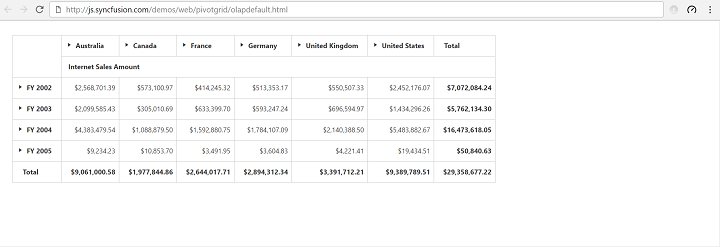
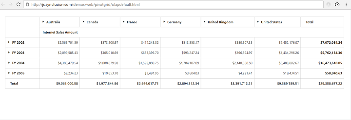
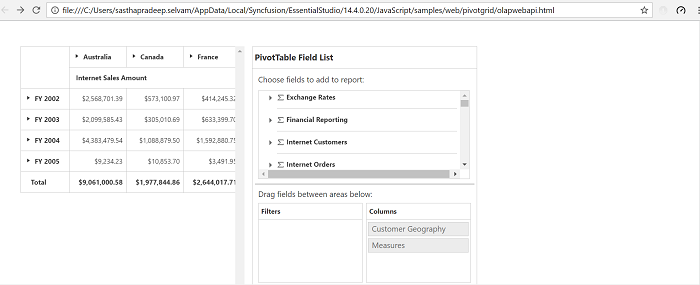
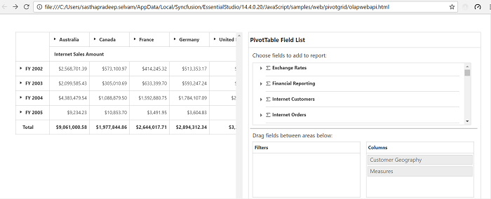

# Responsive

PivotGrid and PivotTable Field list control supports responsive rendering based on the target device (desktop & tablet) resolution. It supports resolution upto 1024x600. You can enable responsiveness in PivotGrid by setting [`isResponsive`](/api/js/ejpivotgrid#members:isresponsive) property to true. 

On resizing the browser, the PivotTable Field list will get collapse and an icon will appear on the left-hand side of the browser. User can toggle its view and perform UI interaction.



    



_Normal PivotGrid_
{:.caption}

_Responsive PivotGrid_
{:.caption}

_Normal PivotTable Field List_
{:.caption}

_Responsive PivotTable Field List_
{:.caption}

