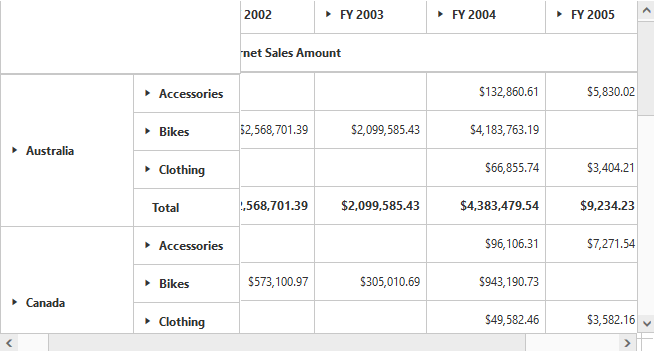

# Frozen Header

Allows you to freeze the header of the Grid so that it will be always visible when scrolling the content with a large number of rows or columns providing a precise view.



    



We can also freeze the row/column headers individually by setting the below properties.



    

    




    



