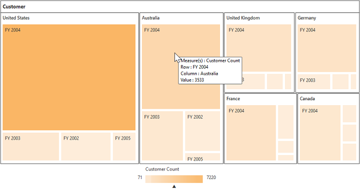
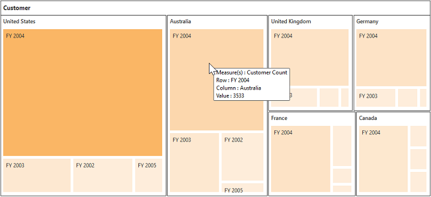

#Legend

##Legend Visibility

The legend shows the value range differences and color occurrence in the respective leaf node while you hover it with the cursor.

N> By default, the legend is visible in PivotTreeMap.

You can disable the legend by setting the property **showLegend** as **false**. The following code example shows how to disable the legend.



<body>
    

        

        <!--Tooltip labels can be localized here-->
           
    

    
</body>



