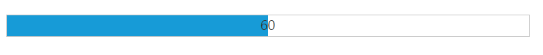
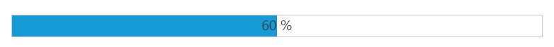

# Define value

## Value

The value for the ProgressBar is set by using [value](https://help.syncfusion.com/api/js/ejprogressbar#members:value) property. The value should be between the minimum (min) and the maximum (max) values (number) of the ProgressBar. By default, the **minValue** is **0** and the **maxValue** is **100** in ProgressBar, and the ‘**value**’ is set to **0**(number).

The following steps explains that how to set the **value** for the ProgressBar widget.

 In the **HTML** page, add a **&lt;div&gt;** element to render the ProgressBar widget.



    





angular.module('ProgressBarApp', ['ejangular'])
.controller('ProgressBarCtrl', function ($scope) {
    $scope.create = function () {
        var progress = $("#progressbar").data("ejProgressBar");
        progress.setModel({ text: progress.getValue() });
    }
});



The following screenshot displays the output for the above code.

 

##  Percentage

The ProgressBar value is set in ProgressBar by using the **‘percentage’** property. The value range should be between the min and max values (number) of the ProgressBar. By default, the **minValue** is **0** and the **maxValue** is **100** in ProgressBar, and **percentage** is set to **0** (number).

The following steps explains that how to set the value in **percentage** for the ProgressBar widget. 

In the **HTML** page, add a **&lt;div&gt;** element to render the ProgressBar widget.



   

    

   





angular.module('ProgressBarApp', ['ejangular'])
.controller('ProgressBarCtrl', function ($scope) {
    $scope.create = function () {
        var progress = $("#progressbar").data("ejProgressBar");
        progress.setModel({ text: progress.getValue() + " %" });
    }
});       



The following screenshot displays the output.

