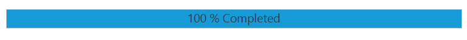

# Setting Range

The **range** of the ProgressBar is set by using minimum and maximum values. The Minimum value specifies the value where the ProgressBar shows the process to have started. The Maximum value specifies the value where the process is completed. You can set the range by using the [minValue](https://help.syncfusion.com/api/js/ejprogressbar#members:minvalue) and [maxValue](https://help.syncfusion.com/api/js/ejprogressbar#members:maxvalue) property.

In the **HTML** page, add a **&lt;div&gt;** element to render the ProgressBar widget.



   

    

   





angular.module('ProgressBarApp', ['ejangular'])
.controller('ProgressBarCtrl', function ($scope) {
    $scope.create = function () {
        var progress = $("#progressbar").data("ejProgressBar");
        progress.setModel({ text: progress.getPercentage() + " % Completed" });
    }
}); 



The following screenshot displays the output.

 

