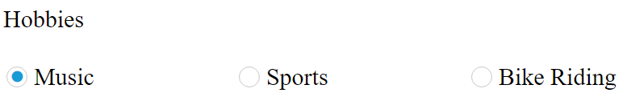
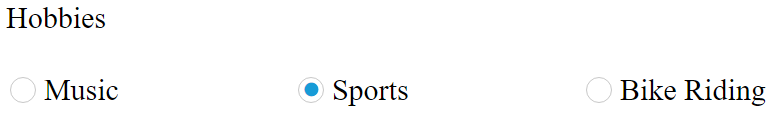

# Behavior Settings

In AngularJS, **ej-radioButton** control allows you to check an option to perform an action. This control allows you to select true or false or an intermediate option. These **ej-radioButton** control are supported with themes.
This section helps us to render the **ej-radioButton** component in AngularJS platform.

**HTML View Section**



        

                Hobbies   
                <table>

                        <tr>
                    <td class="chkrad">
                            <input type="radio" ej-radiobutton id="radio1" name="hobbies" e-value="Music" e-checked="true"/>
                            <label for="radio1">Music</label>
                        
                        </td>
                        <td class="chkrad">
                            <input type="radio" ej-radiobutton id="radio3" name="hobbies" e-value="Sports" ng-model="all"/>
                            <label for="radio3">Sports</label>
                        </td>
                        <td class="chkrad">
                            <input type="radio" ej-radiobutton id="radio4" name="hobbies" e-value="BikeRiding"/>
                            <label for="radio4">Bike Riding</label>
                        </td>
                    </tr>
            </table> 
             
        

 

**Controller Section**

 

    

 

## Checked	

This checked API of the **RadioButton** specifies whether **ej-radioButton** must be in checked state or not.By default,we can set the **ej-radioButton** in checked state for our application.

**HTML View Section**



        
     <table>
           <tr>
               <td class="chkrad">
                    <input type="radio" ej-radiobutton id="radio1" name="hobbies" e-value="Music" e-checked/>
                    <label for="radio1">Music</label>
                
                </td>
                <td class="chkrad">
                    <input type="radio" ej-radiobutton id="radio3" name="hobbies" e-value="Sports" />
                    <label for="radio3">Sports</label>
                </td>
                <td class="chkrad">
                    <input type="radio" ej-radiobutton id="radio4" name="hobbies" e-value="BikeRiding"/>
                    <label for="radio4">Bike Riding</label>
                </td>
            </tr>
        </table>

 

**Controller Section**



    

 

The code will render the following output.

 

## enabled

      In AngularJS, enabled API of **ej-radioButton** control specifies the RadioButton control state. The enabled API can be set with Boolean value whether as true or false to specifies current state of the component.

**HTML View Section**



        <table>

                <tr>
               <td class="chkrad">
                    <input type="radio" ej-radiobutton id="radio1" e-value="Music" name="hobbies" e-checked="true" e-enabled="false"/>
                    <label for="radio1">Music</label>
                
                </td>
                <td class="chkrad">
                    <input type="radio" ej-radiobutton id="radio3" name="hobbies" e-value="Sports" />
                    <label for="radio3">Sports</label>
                </td>
                <td class="chkrad">
                    <input type="radio" ej-radiobutton id="radio4" name="hobbies" e-value="BikeRiding"/>
                    <label for="radio4">Bike Riding</label>
                </td>
            </tr>
        </table>

 

**Controller Section**



   

 

The above code will render the following output.

 

## enableRTL

In AngularJS, enableRTL API of the **ej-radioButton** control is used to specify the right to left direction to that control.

**HTML View Section**


  
  <table>

                <tr>
               <td class="chkrad">
                    <input type="radio" ej-radiobutton id="radio1" e-value="Music" name="hobbies" e-checked="true" e-enableRTL="true"/>
                    <label for="radio1">Music</label>
                
                </td>
                <td class="chkrad">
                    <input type="radio" ej-radiobutton id="radio3" name="hobbies" e-value="Sports" />
                    <label for="radio3">Sports</label>
                </td>
                <td class="chkrad">
                    <input type="radio" ej-radiobutton id="radio4" name="hobbies"  e-value="BikeRiding"/>
                    <label for="radio4">Bike Riding</label>
                </td>
            </tr>
        </table><



**Controller Section**



    



The above code will render the following output.

 

## enablePersistence

In AngularJS, **e-enablePersistence** API specifies the persist property for **ej-radioButton** while initialization. The persist API save current model value to browser cookies for state maintains. While refreshing the ej-radioButton control page the model value apply from browser cookies.

**HTML View Section**



   <table>
            <tr>
                <td class="chkrad">
                    <input type="radio" ej-radiobutton id="radio1" e-value="Music" name="hobbies" e-enablepersistence="true" />
                    <label for="radio1">Music</label>
                </td>
                <td class="chkrad">
                    <input type="radio" ej-radiobutton id="radiobutton3" e-value="Sports" name="hobbies" e-enablepersistence="true"/>
                    <label for="radiobutton3">Sports</label>
                </td>
                <td class="chkrad">
                    <input type="radio" ej-radiobutton id="radiobutton4" e-value="BikeRiding" name="hobbies" e-enablepersistence="true"/>
                    <label for="radiobutton4">Bike Riding</label>
                </td>
            </tr>
        </table>



**Controller Section**



    



 