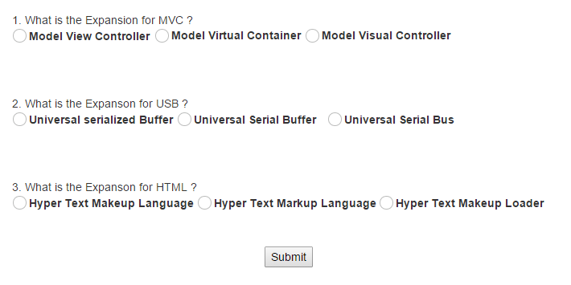
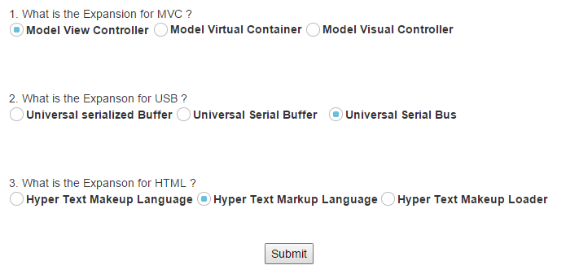

# Getting Started

This section briefly describes you on how to create a QuizApp and RegistrationApp using Essential JavaScript RadioButton control and use the features available in it.**Essential JavaScript** **RadioButton** supports RTL, custom skins and events to display customized RadioButtons. In this example, you can learn how to use RadioButtons in a Quiz application. The following guidelines show you how to use the **RadioButton** to select the answers in the application and get the selected items. The following screenshot displays a sample Quiz application.

 

## Create a RadioButton in a Quiz Application

**Essential JavaScript RadioButton** is created by using a simple input textbox element as follows.

1. Create an HTML file and add required scripts and CSS files to render the Essential JavaScript component as given in the [Getting Started](https://help.syncfusion.com/js/control-initialization).
2. Essential JavaScript includes angular directives for all controls with the ej.widget.angular.min.js script file. All the Essential JS directives have been encapsulated into a single module called **ejangular**. To render our ej controls in angular, you need to refer the “angular.min.js” and “ej.widget.angular.min.js” in your application.



<html xmlns="http://www.w3.org/1999/xhtml" ng-app="RadioCtrl">
<head>
    <meta name="viewport" content="width=device-width, initial-scale=1.0" charset="utf-8"  />
     <!-- Style sheet for default theme (flat azure) -->
    <link href="http://cdn.syncfusion.com/{{ site.releaseversion }}/js/web/flat-azure/ej.web.all.min.css"rel="stylesheet"/>
    <!--Scripts-->
    
    
    <!--Add custom scripts here -->
</head>
    <body style="background-color: #fcf7f7" ng-controller="RadioButtonCtrl">
        <!-- Add RadioButton element here --> 
    </body>
</html>



The ng-app directive explains the root element (<html> or <body> tags) of the application. You will assign a name to the ng-app directive, then you must create a module with that name. In this module, you will have to define your directives, services, filters and configurations.

Properties can be bind to ejRadioButton control using the prefix e- and particular property name as shown as below

 Add input element to render a **RadioButton**.


    

        1. What is the Expansion for MVC ?  
        <table>
            <tr>
                <td>
                    <input type="radio" name="small1" id="Radio1" ej-radiobutton e-size="size1" /><label for="Radio1">Model View Controller</label>
                </td>
                <td colspan="2">
                    <input type="radio" name="small1" id="Radio2" ej-radiobutton e-size="size2" /><label for="Radio2">Model Virtual Container</label>
                </td>
                <td colspan="2">
                    <input type="radio" name="small1" id="Radio3" ej-radiobutton e-size="size3" /><label for="Radio3">Model Visual Controller</label>
                </td>
            </tr>
        </table>
           
        2.  What is the Expanson for USB ? 
        <table>
            <tr>
                <td>
                    <input type="radio" name="small2" id="Radio4" ej-radiobutton e-size="size4" /><label for="Radio4">Universal serialized Buffer</label>
                </td>
                <td>
                    <input type="radio" name="small2" id="Radio5" ej-radiobutton e-size="size5" /><label for="Radio5">Universal Serial Buffer</label>
                </td>
                <td>
                    <input type="radio" name="small2" id="Radio6" ej-radiobutton e-size="size6" /><label for="Radio6">Universal Serial Bus</label>
                </td>
            </tr>
        </table>
           
        3.   What is the Expanson for HTML ? 
        <table>
            <tr>
                <td>
                    <input type="radio" name="small3" id="Radio7" ej-radiobutton e-size="size7" /><label for="Radio7">Hyper Text Makeup Language</label>
                </td>
                <td>
                    <input type="radio" name="small3" id="Radio8" ej-radiobutton e-size="size8" /><label for="Radio8">Hyper Text Markup Language</label>
                </td>
                <td>
                    <input type="radio" name="small3" id="Radio9" ej-radiobutton e-size="size9" /><label for="Radio9">Hyper Text Makeup Loader</label>
                </td>
            </tr>
        </table>
          

            <button id="submitid" ej-button e-onclick="button">Submit</button>
        

    
   


 Add the following angular module in script section.


    
    


 Add the following styles


    


The following screenshot displays the output for the above code.

 

