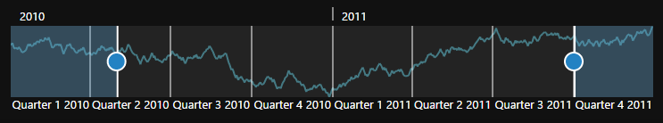

# Appearance and Styling

**JavaScript RangeNavigator** is enriched with lots of customization options for labels, gridlines and slider to develop high quality graphic rich control.

## Customize labels

The labels are found along the range, displaying the value of the data it correspond, both on (higher level label) and below (lower level label) the **RangeNavigator**. **RangeNavigator** labels are further customized using higher level label **style** property of **font** and lower level label **style** property of **font** property in **labelSettings**.

The higher level labels font **color**, **fontFamily**, **fontStyle**, **fontWeight**, **opacity** and **size** can be customized using **higherLevel** property.

The lower level labels font **color**, **fontFamily**, **fontStyle**, **fontWeight**, **opacity** and **size** can be customized using **lowerLevel** property.



<html xmlns="http://www.w3.org/1999/xhtml" lang="en" ng-app="RangeApp">
    <head>
        <title>Essential Studio for AngularJS: RangeNavigator</title>
        <!--CSS and Script file References -->
    </head>
    <body ng-controller="RangeCtrl">
       

       <ej-rangenavigator  e-labelsettings-higherlevel-style-font-color="#ff0000"
       e-labelsettings-higherLevel-style-font-style="normal" 
       e-labelsettings-higherLevel-style-font-weight="regular" 
       e-labelsettings-higherLevel-style-font-size="12px" 
       e-labelsettings-higherLevel-style-font-opacity="1" 
       e-labelsettings-lowerLevel-style-font-color="#ff0000" 
       e-labelsettings-lowerLevel-style-font-size="12px"  
       e-labelsettings-lowerLevel-style-font-opacity="1" 
       e-labelsettings-lowerLevel-style-font-style="normal" 
       e-labelsettings-lowerLevel-style-font-weight="normal">
       </ej-rangenavigator>
       

    
   </body>
</html>

  


 

## Label Placement

Labels in **RangeNavigator** are placed inside or outside of the control. You can customize both the higher and lower level labels using **labelPlacement** property in label setting of **RangeNavigator**. By default **labelPlacement** is "outside" for the both higher and lower level labels.

The following screen shot illustrates both the lower and higher level labels that are placed outside the control with **labelPlacement** specified as outside.


<html xmlns="http://www.w3.org/1999/xhtml" lang="en" ng-app="RangeApp">
    <head>
        <title>Essential Studio for AngularJS: RangeNavigator</title>
        <!--CSS and Script file References -->
    </head>
    <body ng-controller="RangeCtrl">
       

       <ej-rangenavigator  e-labelsettings-higherLevel-labelplacement="inside"
       e-labelsettings-lowerLevel-labelPlacement="inside"></ej-rangenavigator>
       

    
   </body>
</html>



The following screenshot illustrates a **RangeNavigator** with labels inside the control after specifying the **labelPlacement** as inside.

 

## Customize RangeNavigator

### Customize NavigatorStyleSettings

RangeNavigator is customized using **navigatorStyleSettings** properties. You can customize the selected and unselected region color and opacity using **selectedRegionColor**, **unselectedRegionColor**, **selectedRegionOpacity**, **unselectedRegionOpacity** in **navigatorStyleSettings** and the thumb of the slider using **thumbColor, thumbRadius** and **thumbStroke** in **navigatorStyleSettings.  majorGridLineStyle** and **minorGridLineStyle**  are used to customize the grid line **color** and **visibility**. You can customize the **background**, **opacity** and **border color**, **dashArray** and **width** of navigatorStyleSettings.

### Customize Labels

The visibility of labels are enabled by setting **visible** in higher level and visible in lower level. The labels can be aligned by specifying **horizontalAlignment** of higher level style and horizontalAlignment of lower level style. You can customize the **border color** and **width**, fill, **gridLineStyle color**, **dashArray** and **width**, **position** property of higher level labels in labelSettings. You can also customize the border color and width, fill, gridLineStyle color, dashArray and width, position property for lower level labels of labelSettings.



 <html xmlns="http://www.w3.org/1999/xhtml" lang="en" ng-app="RangeApp">
    <head>
        <title>Essential Studio for AngularJS: RangeNavigator</title>
        <!--CSS and Script file References -->
    </head>
    <body ng-controller="RangeCtrl">
       

       <ej-rangenavigator e-navigatorstylesettings-unselectedregioncolor="white" 
       e-navigatorstylesettings-selectedRegionColor="#5EABDE" 
       e-navigatorstylesettings-thumbColor="white"
       e-navigatorstylesettings-thumbRadius="10" 
       e-navigatorstylesettings-thumbStroke="#303030" 
       e-navigatorstylesettings-background="transparent" 
       e-navigatorstylesettings-border-color="black" 
       e-navigatorstylesettings-border-width="3" 
       e-navigatorstylesettings-majorGridLineStyle-color="transparent"
       e-navigatorstylesettings-minorGridLineStyle-color="transparent"
       e-labelsettings-higherLevel-style-font-color="black" 
       e-labelsettings-higherLevel-style-font-size="13px" 
       e-labelsettings-higherLevel-style-font-opacity="1"
       e-labelsettings-higherLevel-style-horizontalAlignment="left" 
       e-labelsettings-higherLevel-intervalType="years" 
       e-labelsettings-higherLevel-labelPlacement="inside"
       e-labelsettings-lowerLevel-style-font-color="black" 
       e-labelsettings-lowerLevel-style-font-size="12px" 
       e-labelsettings-lowerLevel-style-font-opacity="1" 
       e-labelsettings-lowerLevel-style-horizontalAlignment="center" 
       e-labelsettings-lowerLevel-intervalType="quarters" 
       e-labelsettings-lowerLevel-labelPlacement="inside">
       </ej-rangenavigator>
       

    
   </body>
</html>



 

## Themes

**RangeNavigator** **theme** is a set of pre-defined options that are applied to the control before each **RangeNavigator** is instantiated. Following predefined themes are available in JavaScript **RangeNavigator**.

1. flat-light
2. flat-dark
3. gradient-light 
4. gradient-dark 
5. azure                      
6. azure-dark               
7. lime 
8. lime-dark
9. saffron
10. saffron-dark
11. gradient-azure
12. gradient-azure-dark
13. gradient-lime
14. gradient-lime-dark
15. gradient-saffron
16. gradient-saffron-dark



<html xmlns="http://www.w3.org/1999/xhtml" lang="en" ng-app="RangeApp">
    <head>
        <title>Essential Studio for AngularJS: RangeNavigator</title>
        <!--CSS and Script file References -->
    </head>
    <body ng-controller="RangeCtrl">
       

       <ej-rangenavigator e-theme="azuredark"></ej-rangenavigator>
         

    
   </body>
</html>



 
