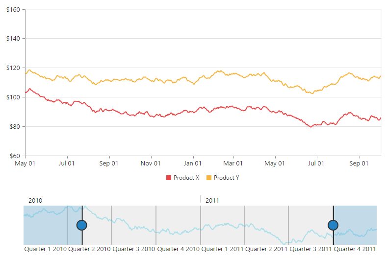

# Behavior Customization

**RangeNavigator** allows you to customize the control using events. You can change the range for selected data of the **RangeNavigator** using events.

## Deferred update

If you set **enableDeferredUpdate**to true, the **rangeChanged** event gets fired after dragging and dropping the slider. By default the **enableDeferredUpdate**is true. If **enableDeferredUpdate**is false then the **rangeChanged** event gets fired while dragging the slider.



<html xmlns="http://www.w3.org/1999/xhtml" lang="en" ng-app="RangeApp">
    <head>
        <title>Essential Studio for AngularJS: RangeNavigator</title>
        <!--CSS and Script file References -->
    </head>
    <body ng-controller="RangeCtrl">
       

       <ej-rangenavigator e-enabledeferredupdate="true">
       </ej-rangenavigator>
       

    
   </body>
</html>



 

## Destroy Method 

`_destroy`: function

This method is used to destroy the **RangeNavigator** widget. 



    <ej-rangenavigator></ej-rangenavigator>



## Handle Events

**load**: function

This event is fired when **RangeNavigator** is loading. A parameter **sender** is passed to the handler. Using **sender.model**, you can access the RangeNavigator properties. 



<body ng-controller="RangeCtrl">
    

        <ej-rangenavigator e-load=loaded></ej-rangenavigator>
    

    
</body>



**loaded:** function

This event is handled when the **RangeNavigator** gets loaded. A parameter **sender** is passed to the handler. Using **sender.model**, you can access the RangeNavigator properties. 



<html xmlns="http://www.w3.org/1999/xhtml" lang="en" ng-app="RangeApp">
    <head>
        <title>Essential Studio for AngularJS: RangeNavigator</title>
        <!--CSS and Script file References -->
    </head>
    <body ng-controller="RangeCtrl">
       

       <ej-rangenavigator e-loaded=loaded></ej-rangenavigator>
       

    
   </body>
</html>



**rangeChanged**: function

This event gets fired whenever the selected range changes in **RangeNavigator**. A parameter **sender** is passed to the handler. Using sender.selectedRangeSettings, you can access the start and end value of range for the selected region. 



<html xmlns="http://www.w3.org/1999/xhtml" lang="en" ng-app="RangeApp">
    <head>
        <title>Essential Studio for AngularJS: RangeNavigator</title>
        <!--CSS and Script file References -->
    </head>
    <body ng-controller="RangeCtrl">
       

       <ej-rangenavigator e-rangechanged=rangeChanged></ej-rangenavigator>
       

    
   </body>
</html>



**selectedRangeStart** : function

This event is fired when starting to change the slider position in **RangeNavigator**. A parameter **sender** is passed to the handler. Using sender.selectedRangeSettings, you can access the start value of range for the selected region. 



<body ng-controller="RangeCtrl">
    

        <ej-rangenavigator e-selectedrangestart=rangeStart></ej-rangenavigator>
    

    
</body>



**selectedRangeEnd** : function

This event is fired when selection ends in **RangeNavigator**. A parameter **sender** is passed to the handler. Using sender.selectedRangeSettings, you can access the end value of range for the selected region. 



<body ng-controller="RangeCtrl">
    

        <ej-rangenavigator e-selectedrangeend=rangeEnd></ej-rangenavigator>
    

    
</body>



**scrollStart** : function

This event is fired when starting to change the scrollbar position of **RangeNavigator**. A parameter **sender** is passed to the handler. Using sender.data startRange and sender.data endRange, you can access the scrollbar position starting and ending range value on changed scrollbar. 



<body ng-controller="RangeCtrl">
    

        <ej-rangenavigator e-scrollstart=scrollStart></ej-rangenavigator>
    

    
</body>



**scrollEnd** : function

This event is fired while ending the change in scrollbar position of **RangeNavigator**. A parameter **sender** is passed to the handler. Using data oldRange and data newRange, you can access the scrollbar position old and new range values on changing scrollbar. 



<body ng-controller="RangeCtrl">
    

        <ej-rangenavigator e-scrollend=scrollEnd></ej-rangenavigator>
    

    
</body>



**scrollChanged** : function

This event is fired when changing the scrollbar position of **RangeNavigator**. A parameter **sender** is passed to the handler. Using data oldRange and data newRange, you can access the old and new range values of changed scrollbar position. 



<body ng-controller="RangeCtrl">
    

        <ej-rangenavigator e-scrollchanged=scrollChange></ej-rangenavigator>
    

    
</body>



## Use of ZoomCoordinates

**RangeNavigator** is used along with the controls like chart and grid to view the selected data. To update chart/grid, whenever the selected range changes in **RangeNavigator**, you can use **rangeChanged** event of **RangeNavigator** and then update the chart/grid with the selected data in this event. 

You can easily update the data for chart by assigning the **zoomFactor** and **zoomPosition** of the **RangeNavigator** to the chart axis.



<html xmlns="http://www.w3.org/1999/xhtml" lang="en" ng-app="RangeApp">
    <head>
        <title>Essential Studio for AngularJS: RangeNavigator</title>
        <!--CSS and Script file References -->
    </head>
    <body ng-controller="RangeCtrl">
       

       <ej-rangenavigator e-rangechanged="onChartLoaded"></ej-rangenavigator>
         

    
   </body>
</html>
   



 

## Thumb Template

You can customize Thumb template by using **leftThumbTemplate** and **rightThumbTemplate** property. You can add the required template as a "div" element with an "id" to the web page and assign the id or assign the HTML string to this property under **navigatorStyleSettings**.



 
 <html xmlns="http://www.w3.org/1999/xhtml" lang="en" ng-app="RangeApp">
    <head>
        <title>Essential Studio for AngularJS: RangeNavigator</title>
        <!--CSS and Script file References -->
    </head>
    <body ng-controller="RangeCtrl">
     

       <ej-rangenavigator e-navigatorstylesettings-leftthumbtemplate="left" 
       e-navigatorstylesettings-rightThumbTemplate="right"></ej-rangenavigator>
       

       
       
     
   </body>
</html>      



The following screenshot displays the **RangeNavigator** using thumb template.

 

## Value Axis Settings

You can customize the line, `font` `size`, gridline, tickline, range, `rangePadding` and visibility of **RangeNavigator** axis. To enable the visibility of axis line, you need to set `visible` property of `axisLine` in `valueAxisSettings`. You can customize the axis range by specifying `min`, `max` and `interval` for `range` property. The `majorGridLines` can be enabled by specifying `visible` property. The `size`, `width` and `visible` property of `majorTickLines` is used to customize the axis tick lines. The visibility of valueAxisSettings is enabled by setting `visible` property as true. 



<body ng-controller="RangeCtrl">
    

        <ej-rangenavigator  e-valueaxissettings="valueAxisSetting">
        </ej-rangenavigator>
    

    
</body>



## Selected Range Settings

The start and end range values of selected range can be customized using `start` and `end` property of `selectedRangeSettings`.



<body ng-controller="RangeCtrl">
    

        <ej-rangenavigator  e-selectedrangesettings="selectedRange">
        </ej-rangenavigator>
    

    
</body>



