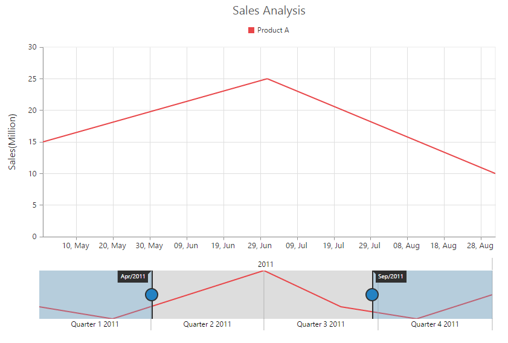
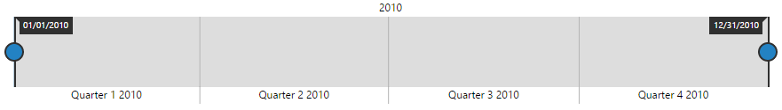
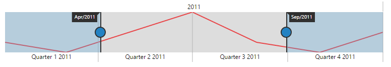
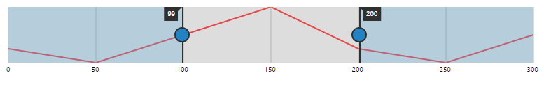

# Getting Started

This section explains briefly about how to create a **RangeNavigator** in your application with **AngularJS**.

## Create your first RangeNavigator in AngularJS

This section encompasses on how to configure the **ej-rangeNavigator** and update the **chart** control for **RangeNavigator’s** selected range. It also helps you to learn how to pass the required data to **RangeNavigator** and customize the scale and selected range for your requirements. In this example, you will look at the steps to configure a RangeNavigator to analyze sales of a product for a particular quarter in a year.

 

## Configure RangeNavigator

Getting started with your **ej-rangenavigator** is simple. You can initialize the **ej-rangenavigator** by setting its range values.

You can create an **HTML** file as shown in the following code example.



<!DOCTYPE html>
<html ng-app="RangeApp">
<head>

</head>
<body ng-controller="RangeCtrl"></body>
</html>



1. Create a &lt;div&gt; tag with an id.
2. Set `ej-rangenavigator` attribute to render RangeNavigator control and add `e-rangeSettings` for customize the rangeSettings.



<body ng-controller="RangeCtrl">

</body>



3. Add a script tag inside the &lt;Body&gt; tag and add the following code example.  

The following code example renders a **RangeNavigator** with a range from 2010, January 1st to December 31st.



    



The following screen shot displays the **RangeNavigator** with a range from 2010, January 1st to December 31st.

 

**Add series**

To add series to **ej-rangenavigator,** you need to set **dataSource** property of **ej-rangenavigator** as shown in the following code example. 

You can create data source for **RangeNavigator** as follows.



   


Now, add the **dataSource** to the **RangeNavigator** and provide the field name to get the values from the **dataSource** in **xName** and **yName** options.



   



The following screenshot displays a RangeNavigator with the default **"Line"** series type.

 

## Tooltip

You can customize **Tooltip** for RangeNavigator using **e-tooltipsettings** option. You can use **tooltipDisplayMode** option in **tooltip**,to display the tooltip "always" or "ondemand" (displays tooltip only while dragging the sliders). You can also specify label format for tooltip using **labelFormat**.

The following code sample shows how to enable a Tooltip.



    



The following screenshot displays the label format **Tooltip** in RangeNavigator:

 

## Update Chart

You can use **ej-rangenavigator** with controls such as **chart** and **grid** to view the range of data selected in **ej-rangenavigator**. 

In order to update **chart**, whenever the selected range changes in **ej-rangenavigator**, you need to use **e-rangechanged** event of **ej-rangenavigator** and then update the **chart** with the selected data in this event. 

You can create a chart with line series using the following code sample.

1. Create a &lt;div&gt; tag with an id.



<body>

        <e-series>
            <e-series e-name="Sales" e-type="line" e-tooltip="tooltipoptions" e-datasource=dataSource e-xname="xDate" e-yname="yValue">
            </e-series>
        </e-series>
    

    
</body>



You can update the chart with the selected data using the **e-rangechanged** event of **ej-rangenavigator**.





The following screenshot displays how a RangeNavigator is updated when a selected range is changed.

 

## Set value type

**ej-rangenavigator** can also be used with numerical values. You can specify the data type using **valueType** option. 

You can create a **dataSource** for Chart Series with integer Values using the following code sample.



    window.chartData = [
    { "xDate": 0, "yValue": 10 },
    { "xDate": 50, "yValue": 5 },
    { "xDate": 100, "yValue": 15 },
    { "xDate": 150, "yValue": 25 },
    { "xDate": 200, "yValue": 10 },
    { "xDate": 250, "yValue": 5 },
    { "xDate": 300, "yValue": 15 },
    ];



Now, you can set the **dataSource** for Chart Series and **valueType** property to "numeric" as given in the following code example.



        

            <e-series e-datasource="dataSource" e-valuetype="numeric" e-xname="xDate" 
            e-yname="yValue" e-type="line"></e-series>
        



The following screenshot displays a RangeNavigator with numerical values:

 

