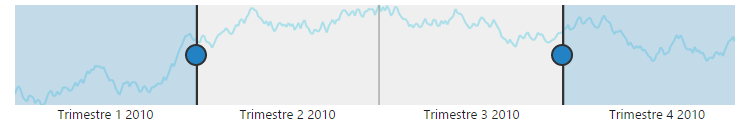
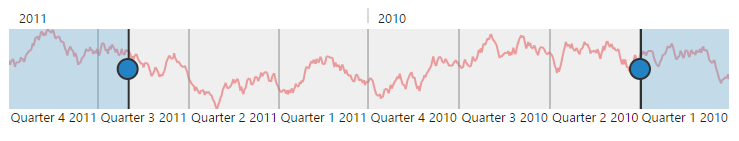

# Globalization & Localization

**RangeNavigator** supports Localization and Globalization to customize the labels based on a culture specific to a country. The culture defines specific information for the number formats, week and month names, date and time formats etc. 

## Localization

The `locale` property is used to specify the Localization of RangeNavigator. **Localization** is the process of customizing the user interface based on a culture specific to a particular country or region in order to display regional data.  The culture is represented by a unique string, for example, ―en-US‖ for U.S. English and ―fr-FR‖ for French (common), this is achieved by creating a JavaScript file “**rangeNavigatorSource.fr-FR.js**” and setting the equivalent word as illustrated in the following code sample.



ej.datavisualization.RangeNavigator.locale["fr-FR"] = {

    intervals: {
        //string to display the intervals on RangeNavigator
        quarter: {longQuarters: "Trimestre", shortQuarters: "T"},
        week: { longWeeks: "Semaine", shortWeeks: "S" }
    }
}



**Localization** is the key feature that provides solutions globally with the help of localized control. 



<html xmlns="http://www.w3.org/1999/xhtml" lang="en" ng-app="RangeApp">
    <head>
        <title>Essential Studio for AngularJS: RangeNavigator</title>
        <!--CSS and Script file References -->
    </head>
    <body ng-controller="RangeCtrl">
       

       <ej-rangenavigator e-locale="FR-fr"></ej-rangenavigator>
         

    
   </body>
</html>



 

## RTL

**Right-to-Left** or **RTL** describes the ability of application to handle and responds you to communicate with a right-to-left language, like Arabic or Japanese. **enableRTL** property is used to change the rendering format  to **"Right to Left"**, by default it renders from **"Left to Right"** in **RangeNavigator**.



<html xmlns="http://www.w3.org/1999/xhtml" lang="en" ng-app="RangeApp">
    <head>
        <title>Essential Studio for AngularJS: RangeNavigator</title>
        <!--CSS and Script file References -->
    </head>
    <body ng-controller="RangeCtrl">
       

       <ej-rangenavigator e-enablertl="true"></ej-rangenavigator>
         

    
   </body>
</html>



 

