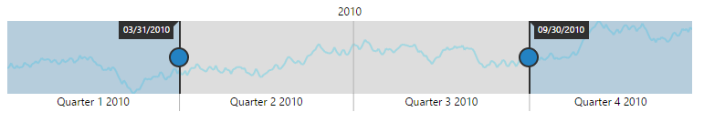

### Populate Data

When you provide data to **RangeNavigator**, it produces limited set of data. You can populate the **RangeNavigator** with data using the **dataSource** and **series** properties.

#### Add series to the RangeNavigator

The **Series** property provides access to a collection of all series that are defined explicitly within a **RangeNavigator** control. Each series is assigned with **type** and name. It contains collection of data point, each point contains x value and y values. You can add data points to the series through **dataSource** property.

Animation can be enabled by setting `e-enableanimation` property as true and the series color and opacity can be customized by using `e-fill` and `e-opacity` property in series. 



<html xmlns="http://www.w3.org/1999/xhtml" lang="en" ng-app="RangeApp">
    <head>
        <title>Essential Studio for AngularJS: RangeNavigator</title>
        <!--CSS and Script file References -->
    </head>
    <body ng-controller="RangeCtrl">
       

       <ej-rangenavigator >
       <e-series>
       <e-series e-type="line" e-datasource=datasource e-enableanimation="true" e-xname="XValue" e-yname="YValue" e-opacity="0.5" e-fill="#69D2E7" 
       e-border-color="transparent" e-border-color-width="2"></e-series>
       </e-series>
       </ej-rangenavigator>
       

    
   </body>
</html>



The following screenshot illustrates the **RangeNavigator** that is populated with data using **dataSource** property in series.

 
