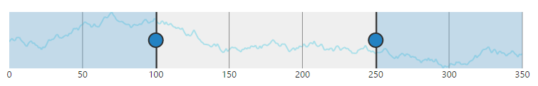
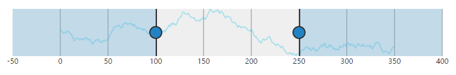
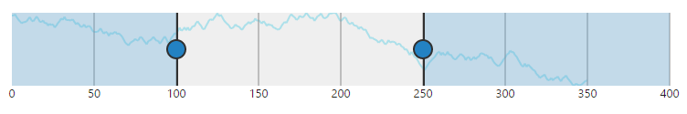
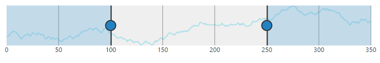
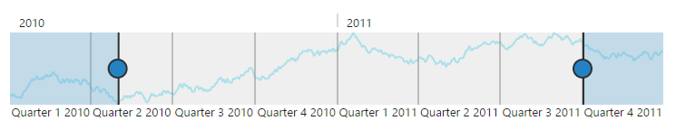
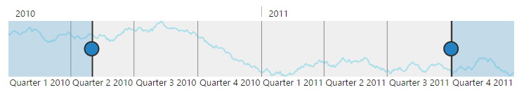
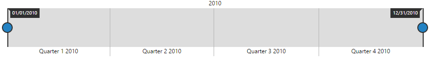

# Range Padding

**Range Padding** adds padding for range in **RangeNavigator**. It allows you to space the grid lines in the **RangeNavigator**.  By default, this property is set to **none**.

## Numeric

The **rangePadding** property allows you to customize the automatic range calculation using the default auto range calculation for **RangeNavigator**.



<html xmlns="http://www.w3.org/1999/xhtml" lang="en" ng-app="RangeApp">
    <head>
        <title>Essential Studio for AngularJS: RangeNavigator</title>
        <!--CSS and Script file References -->
    </head>
    <body ng-controller="RangeCtrl">
       

       <ej-rangenavigator e-valuetype="numeric" e-rangepadding="none">
       </ej-rangenavigator>
       

    
   </body>
</html>



### None

By default, the **rangePadding** for numerical range is none. The range is calculated from the minimum value to the maximum value of data in the RangeNavigator.

The following screenshot illustrates a **RangeNavigator** with **rangePadding** set to none.

 

### Additional

When you set the **rangePadding** for numerical range to **Additional**, range is padded with an interval.

The following screenshot illustrates a **RangeNavigator** with **rangePadding** set to additional.

 

### Normal

In normal **rangePadding**, automatic range calculation differs based on the data. 

The following screenshot illustrates **RangeNavigator** with **rangePadding** set to normal

 

### Round

Round **rangePadding** for a numerical range rounds the range of the control to the nearest possible value that is divisible by the interval.

The following screenshot illustrates a **RangeNavigator** with **rangePadding** set to **Round**.

 

## DateTime

Using the default range calculation for **RangeNavigator**, the **rangePadding** property allows you to customize the range.



<html xmlns="http://www.w3.org/1999/xhtml" lang="en" ng-app="RangeApp">
    <head>
        <title>Essential Studio for AngularJS: RangeNavigator</title>
        <!--CSS and Script file References -->
    </head>
    <body ng-controller="RangeCtrl">
       

       <ej-rangenavigator  e-rangepadding="none">
       </ej-rangenavigator>
       

    
   </body>
</html>



### None

By default, the **rangePadding** for **DateTime** range is none. The range is calculated from the minimum value to the maximum value of data in the RangeNavigator

The following screenshot illustrates a **RangeNavigator** with **rangePadding** set to none.

 

### Round

Round **rangePadding** for a **DateTime** range rounds the range of the control to the nearest possible value.

The following screenshot illustrates a **RangeNavigator** with **rangePadding** set to Round.

 

## Padding

The gap between the container and the **RangeNavigator** can be specified using **e-padding** property.



    <ej-rangenavigator  e-padding="15">
    </ej-rangenavigator>



## AllowSnapping

An **e-allowsnapping** property toggles the placement of slider exactly on the place it left or on the nearest interval.



    <ej-rangenavigator  e-allowsnapping="false">
    </ej-rangenavigator>



## Responsive

Set **e-isresponsive** value to make the **RangeNavigator** responsive on resize.



    <ej-rangenavigator  e-isresponsive="true">
    </ej-rangenavigator>

   


## Auto Resizing

Enable **e-enableautoresizing** option to resize the **RangeNavigator**.



    <ej-rangenavigator  e-enableautoresizing="true">
    </ej-rangenavigator>



## Customize range Navigator border

**RangeNavigator** provides options to customize the `color`, `opacity` and `width` of range navigator `e-border`.



    <ej-rangenavigator  e-border="border">
    </ej-rangenavigator>



## Customize size of range navigator

The `height` and `width` of **RangeNavigator** can be customized using `e-sizesettings` property.



    <ej-rangenavigator  e-sizesettings="size">
    </ej-rangenavigator>



## Customize axis range of navigator

**RangeNavigator** calculates the range automatically based on the values of series data points. However you can explicitly specify the range using the **start**, **end** properties in **rangeSettings** that is not possible when data is provided.

The following code example renders a RangeNavigator with a range from 2010 January 1st to 2013 January 1st.



<html xmlns="http://www.w3.org/1999/xhtml" lang="en" ng-app="RangeApp">
    <head>
        <title>Essential Studio for AngularJS: RangeNavigator</title>
        <!--CSS and Script file References -->
    </head>
    <body ng-controller="RangeCtrl">
       

       <ej-rangenavigator e-rangesettings-start="2010/1/1" 
       e-rangesettings-end="2012/12/1" e-rangepadding="none">
       </ej-rangenavigator>
       

    
   </body>
</html>



 
