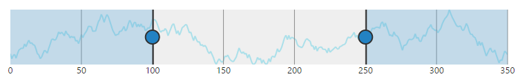
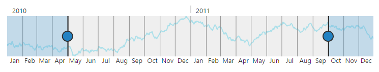
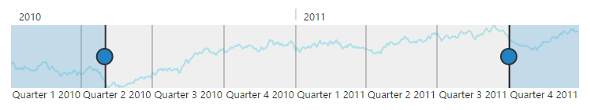

### Range Types

**RangeNavigator** control is designed to visualize large number of data and navigate to particular data from the large collection at ease. The data for the **RangeNavigator** is either numeric values or **DateTime** values and the **valueType** property in **RangeNavigator** indicates the type of the data that should be passed for the control. By default the **valueType** of **RangeNavigator** is **DateTime**

* Numeric                 
* DateTime

## Numeric Type

**RangeNavigator** is also used with numeric data and the **valueType** for this data is “**numeric**”



<html xmlns="http://www.w3.org/1999/xhtml" lang="en" ng-app="RangeApp">
    <head>
        <title>Essential Studio for AngularJS: RangeNavigator</title>
        <!--CSS and Script file References -->
    </head>
    <body ng-controller="RangeCtrl">
       

       <ej-rangenavigator e-valuetype="numeric"></ej-rangenavigator>
       

    
   </body>
</html>
  



The following screenshot displays the **RangeNavigator** with numeric data.

 

## DateTime

By default the **valueType** of the **RangeNavigator** is “**datetime**” and represents the **DateTime** values.



<html xmlns="http://www.w3.org/1999/xhtml" lang="en" ng-app="RangeApp">
    <head>
        <title>Essential Studio for AngularJS: RangeNavigator</title>
        <!--CSS and Script file References -->
    </head>
    <body ng-controller="RangeCtrl">
       

       <ej-rangenavigator e-valuetype="datetime" ></ej-rangenavigator>
       

    
   </body>
</html>



 

## DateTime Intervals

The **DateTime** range type contains an **intervalType** property that sets the **DateTime** interval to one of the following:

* Years
* Quarters
* Months
* Weeks
* Days 
* Hours

By default **intervalType** for higher level labels are **years** and for lower level labels its **quarters.**



<html xmlns="http://www.w3.org/1999/xhtml" lang="en" ng-app="RangeApp">
    <head>
        <title>Essential Studio for AngularJS: RangeNavigator</title>
        <!--CSS and Script file References -->
    </head>
    <body ng-controller="RangeCtrl">
       

       <ej-rangenavigator  e-valuetype="datetime" e-labelsettings-higherlevel-intervaltype="years" 
       e-labelsettings-lowerLevel-intervalType="quarters"></ej-rangenavigator>
       

    
   </body>
</html>



 
