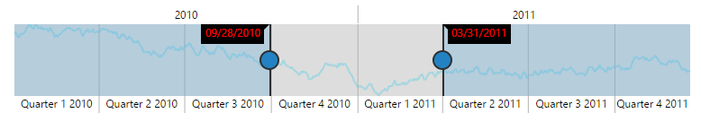
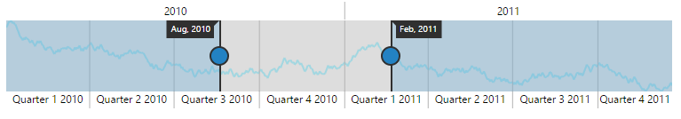
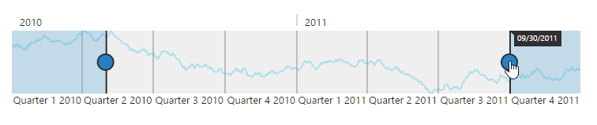

# Tooltip

**RangeNavigator** provides **Tooltip** support for sliders. Sliders are used to select data at particular range in the **RangeNavigator** control. **Tooltips** for sliders display the selected start and end **DateTime** values.

## Customization

**RangeNavigator** provides support for you to customize the text display in the tooltip and background using **tooltipSettings** property. You can change font family, font color, font style, font weight. By default “**Segoe UI**” font family is set to tooltip text.

* Tooltip visibility can be enabled or disabled using `visible` property.
* You can change background color of tooltip using `backgroundColor` property.
* You can customize the `color`, `family`, `fontStyle`, `opacity`, `size` and `weight` of tooltip text in `font` property.



<html xmlns="http://www.w3.org/1999/xhtml" lang="en" ng-app="RangeApp">
    <head>
        <title>Essential Studio for AngularJS: RangeNavigator</title>
        <!--CSS and Script file References -->
    </head>
    <body ng-controller="RangeCtrl">
       

       <ej-rangenavigator e-tooltipsettings-visible="true" e-tooltipsettings-backgroundcolor="black" 
       e-tooltipsettings-font-color="red" e-tooltipsettings-font-family="Segoe ui" 
       e-tooltipsettings-font-style="normal" e-tooltipsettings-font-size="12px" 
       e-tooltipsettings-font-opacity="1" e-tooltipsettings-font-weight="regular">
       </ej-rangenavigator>
       

    
   </body>
</html>



 

## Label Format

By default, the **tooltip** texts are automatically determined based on the data points.  To make it readable and understandable you can format the **tooltip** text. For **DateTime** data, all globalized format are supported. By default the **labelFormat** is "MM/dd/yyyy".

Some of the **labelFormat** for **DateTime** data area as follows:

* 'MMM, yyyy'
* 'dd, MMM'
* 'dd/MM/yyyy'
* 'dd, hh:mm'
* 'hh:mm:ss'
* 'hh:mm:ss:tt'



<html xmlns="http://www.w3.org/1999/xhtml" lang="en" ng-app="RangeApp">
    <head>
        <title>Essential Studio for AngularJS: RangeNavigator</title>
        <!--CSS and Script file References -->
    </head>
    <body ng-controller="RangeCtrl">
       

       <ej-rangenavigator e-tooltipsettings-visible="true" e-tooltipsettings-labelformat="MMM,yyyy">
       </ej-rangenavigator>
       

    
   </body>
</html>



 

## Tooltip display mode

By default the **tooltip** for RangeNavigator gets displayed. You can change this behavior using the **tooltipDisplayMode** property in the tooltip and it takes the following values.

<table>
<tr>
<td>
<b>Value</b></td><td>
<b>Description</b></td></tr>
<tr>
<td>
always</td><td>
Tooltip get displayed for RangeNavigator always.</td></tr>
<tr>
<td>
onDemand</td><td>
Tooltip get displayed only when we move the slider.</td></tr>
</table>



<html xmlns="http://www.w3.org/1999/xhtml" lang="en" ng-app="RangeApp">
    <head>
        <title>Essential Studio for AngularJS: RangeNavigator</title>
        <!--CSS and Script file References -->
    </head>
    <body ng-controller="RangeCtrl">
       

       <ej-rangenavigator e-tooltipsettings-visible="true" 
       e-tooltipsettings-tooltipDisplayMode="onDemand"></ej-rangenavigator>
       

    
   </body>
</html>



 
