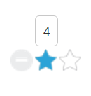
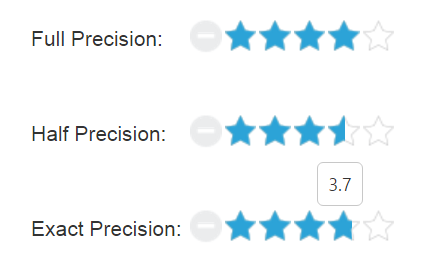
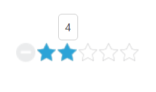
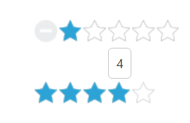
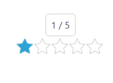

# Rating Customization

## Setting Value

The **Value** property sets the display value of the Rating. For example, when the [Value](https://help.syncfusion.com/api/js/ejrating#members:value) property is set to be **four**, the Rating control renders four ratings. By default, [Value](https://help.syncfusion.com/api/js/ejrating#members:value) property’s value is **one**.

The following code example is used to render the **Rating** control with customized value.

 Add the following HTML to render Rating with customized value.



 

    <table>
        <tr>
            <td valign="top">
                Rating:
            </td>
            <td>
                <input id="rating" type="text" ej-rating e-value="4"/>
            </td>
        </tr>
    </table>



The following screenshot illustrates the **Rating** with custom defined value.

 

### Min Value

**EJ Rating** control provides support for setting [minimum value](https://help.syncfusion.com/api/js/ejrating#members:minvalue). This is achieved by adding minValue property. When the minValue property is set, the Rating value starts with **minValue**+1.

The following code example is used to render the **Rating** control with **minimum** **rating**.

 Add the following HTML to render Rating with minimum value.



   <table>
        <tr>
            <td valign="top">Rating:
            </td>
            <td>
                <input id="rating" type="text" ej-rating e-minvalue="3"/>
            </td>
        </tr>
    </table>



The following screenshot illustrates **Rating** with **minimum** **value**.         

 

### Max Value

**EJ** **Rating** **control** provides support for setting [maximum value](https://help.syncfusion.com/api/js/ejrating#members:maxvalue). This is achieved by adding the **maxValue** property**.** By default, maxValue is five.

The following code example is used to render the Rating control with **maximum** **rating**.

 Add the following HTML to render Rating with maximum value.



   <table>
        <tr>
            <td valign="top">Rating:
            </td>
            <td>
                <input id="rating" type="text" ej-rating e-maxvalue="10"/>
            </td>
        </tr>
    </table>



The following screenshot illustrates the **Rating** with **maximum** **value**.

 

## Set Precision

In a real-time movie **Rating** scenario, you can set **Precision** between two whole numbers such as 2.5 or 3.7 and it is done using the [Precision](https://help.syncfusion.com/api/js/ejrating#members:precision) by changing the value to **ej.Rating.Precision.Half** or **ej.Rating.Precision.Exact.** By default, **Precision** is **Full.**

The following code example is used to render the **Rating** control with **Precision**.

 Add the following HTML to render Rating with Precision.


    <table>
        <tr>
            <td valign="top">Full Precision:
            </td>
            <td>
                <input id="rating" type="text"ej-rating e-value="4"/>               
            </td>
        </tr>   
        <tr>
            <td valign="top">Half Precision:
            </td>
            <td>
                <input id="halfRating" type="text" ej-rating e-precision="half" value="3.5"/>               
            </td>
        </tr>  
        <tr>
            <td valign="top">Exact Precision:
            </td>
            <td>
                <input id="exactRating" type="text" ej-rating e-precision="exact" value="3.7"/>               
            </td>
        </tr>         
    </table>

    




angular.module('ratingApp', ['ejangular'])
    .controller('RatingCtrl', function ($scope) {
        $scope.half = ej.Rating.Precision.Half;
        $scope.exact = ej.Rating.Precision.Exact;

});



The following screenshot illustrates the **Rating** with **Precision**.

 

## Increment Step

**EJ Rating** control supports customized **increment** value for Rating. This is achieved by adding the [incrementStep](https://help.syncfusion.com/api/js/ejrating#members:incrementstep) property.

The following code example is used to render the **Rating** control with customized **increment**.

 Add the following HTML to render Rating with customized increment.



    <table>
        <tr>
            <td valign="top">Rating:
            </td>
            <td>
                <input id="rating" type="text" ej-rating e-incrementstep="2" e-maxvalue="10"/>
            </td>
        </tr>
    </table>



The following screenshot illustrates the **Rating** with customized increment.

 

## Resetting values

**EJ Rating** control provides support for value **reset** at runtime. This is achieved by enabling the [allowReset](https://help.syncfusion.com/api/js/ejrating#members:allowreset) property to be **‘true’.** By default, the property value is set to **‘true’.**

The following code example is used to render the **Rating** control with **allowReset**.

 Add the following HTML to render Rating with allowReset.



    <table>
        <tr>
            <td valign="top">Rating:
            </td>
            <td>
                <input id="rating" type="text" ej-rating e-allowreset="true"/>               
            </td>
        </tr>
        <tr>
            <td valign="top">Rating:
            </td>
            <td>
                 <input id="rest" type="text" ej-rating e-allowreset="false"/>                    
            </td>
        </tr>
    </table>



The following screenshot illustrates the **Rating** with **allowReset**.

 

## Read only

**Rating** control provides support for changeable or unchangeable values for **Rating** control. This is achieved by the [readOnly](https://help.syncfusion.com/api/js/ejrating#members:readonly) property. When this property is set to **‘true’** the **Rating** value becomes unchangeable. By default, this property value is set to **‘false’.**

The following code example is used to render the **Rating** control with **readOnly**.

 Add the following HTML to render Rating with readOnly.



    <table>
        <tr>
            <td valign="top">Rating:
            </td>
            <td>
                <input id="rating" type="text" ej-rating e-readonly="true"/>
            </td>
        </tr>
    </table>



The following screenshot illustrates the **Rating** with **readOnly.**

 

## Enable or Disable

**Rating** control provides support to **enable** or **disable** the control. This is achieved by the [enabled](https://help.syncfusion.com/api/js/ejrating#members:enabled) property. By default the property value is **‘true’.**

The following code example is used to render the **Rating** control with **enable** or **disable** support.

 Add the following HTML to render Rating with enable or disable support.



    <table>
        <tr>
            <td valign="top">Rating:
            </td>
            <td>
                <input id="rating" type="text" ej-rating e-enabled="false" />
            </td>
        </tr>
    </table>

    


The following screenshot illustrates the **Rating** in **disabled** form.

