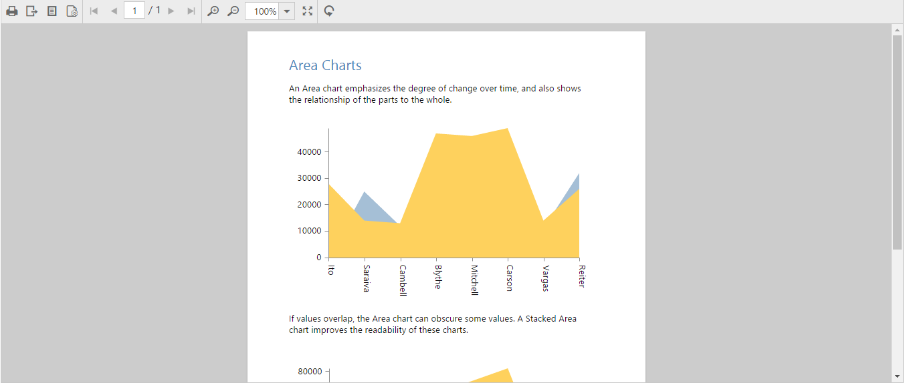

# Getting Started

This section explains briefly about how to create a ReportViewer in your web application with AngularJS.

## Create your first ReportViewer in Angular-1

In this tutorial, you can learn how to create a simple ReportViewer control, Load RDLC Report and Load SSRS Report in your web application with AngularJS.

### Create HTML Page

Create a new HTML file and include the below initial code.



<!DOCTYPE html>
<html lang="en" xmlns="http://www.w3.org/1999/xhtml" ng-app="syncApp">
    <head>
        <meta charset="utf-8" />
        <title> </title>
    </head>
    <body>
    </body>
</html>



### Add Scripts and Styles

Refer the CSS file from the specific theme folder to your HTML file within the head section as shown below. Please refer to our built-in theme [here](https://help.syncfusion.com/js/theming-in-essential-javascript-components).



<head>
    <meta charset="utf-8" />
    <title>Getting Started - ReportViewer</title>
    <link href="http://cdn.syncfusion.com/{{ site.releaseversion }}/js/web/flat-azure/ej.web.all.min.css" rel="stylesheet" />
</head>



Refer the [CDN](https://help.syncfusion.com/js/cdn) script files with other required external dependencies.



<head>
    <meta charset="utf-8" />
    <title>Getting Started - ReportViewer</title>
    <link href="http://cdn.syncfusion.com/{{ site.releaseversion }}/js/web/flat-azure/ej.web.all.min.css" rel="stylesheet" />
    
    
    
    
    
</head>



In the above code, `ej.web.all.min.js`script reference has been added for demonstration purpose. It is not recommended to use this for deployment purpose, as its file size is larger since it contains all the widgets. Instead, you can use[CSG](http://csg.syncfusion.com/# "") utility to generate a custom script file with the required widgets for deployment purpose.

### Add Control in HTML Page

The ng-app directive explains the root element (<html> or <body> tags) of the application. You will assign a name to the ng-app directive, then you must create a module with that name. In this module, you will have to define your directives, services and configurations.

Add the following code example in the &lt;body&gt; tag in the HTML page. Set the desired `processingmode`, `reportPath` and `reportServiceUrl` to ReportViewer.



    
 



N> Default RDL Report will be rendered, which is used in the online service. You can obtain sample rdl/rdlc files from Syncfusion installed location (%userprofile%\AppData\Local\Syncfusion\EssentialStudio\{{ site.releaseversion }}\Common\Data\ejReportTemplate).

### Run the Application

Run the sample application and you can see the ReportViewer on the page as displayed in the following screenshot.

 

ReportViewer with Grouping Aggregate Report
{:.caption}

## Load SSRS Server Reports

ReportViewer supports to load RDL/RDLC files from SSRS Server. The following steps help you to load reports from SSRS Server.

1.Set the `reportPath` from SSRS and SSRS `reportServerUrl` in the ReportViewer properties.



    



N> The credential information for Report Server is provided in online service. 

2.Run the application and you can see the ReportViewer on the page as displayed in the following screenshot.

    
   
   Report from SSRS
   {:.caption}

## Load RDLC Reports

The ReportViewer has data binding support to visualize the RDLC reports. The following code example helps you to bind data to ReportViewer.

1.Assign the RDLC report path to ReportViewer’s `reportPath` property and set the data sources to the ReportViewer’s `dataSources` property and specify the `processingMode` as local.



    



N> Default RDLC Report will be rendered, which is used in the online service. You can obtain sample rdl/rdlc files from Syncfusion installed location (%userprofile%\AppData\Local\Syncfusion\EssentialStudio\{{ site.releaseversion }}\Common\Data\ejReportTemplate).

2.Run the application and you can see the ReportViewer on the page as displayed in the following screenshot.

    
   
   Area Chart RDLC Report
   {:.caption}

