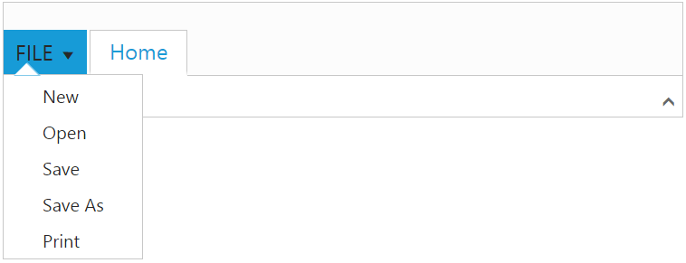
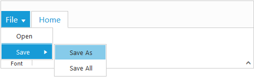

# Application Tab

The Application Tab is used to represent a `Menu` that do some operations, such as File menu to create, open, and print documents. Application Tab classified by the following property:

*  menu
*  backstage

## Application Menu

The Application Menu is similar to traditional file menu options and Syncfusion `ejMenu` control is used internally to render this. To show Application Menu in Ribbon, set the type as `menu` and menuSettings to customize properties of `ejMenu`.

### _Create Using Template_

Set the UL element `id` to `e-applicationtab-menuitemid` property to create Application Menu and it will acts as template to render menu.


    
    <!DOCTYPE html>
    <html xmlns="http://www.w3.org/1999/xhtml" lang="en" ng-app="RibbonApp">
    <head>
    <title>Essential Studio for AngularJS: Ribbon</title>
    </head>
    <body ng-controller="RibbonCtrl">
    <ul id="ribbonmenu">
        <li>
            <a>FILE</a>
            <ul>
                <li><a>New</a></li>
                <li><a>Open</a></li>
                <li><a>Save</a></li>
                <li><a>Save As</a></li>
                <li><a>Print</a></li>
            </ul>
        </li>
    </ul>
    

        <e-tabs>
            <e-tab e-id="home" e-text="Home"></e-tab>
        </e-tabs>
    

    
    </body>
    </html>



## Backstage Page

The Backstage page is where documents and related data of those can be managed, such as Create, Save and other information.

The Backstage page has a feature to add custom Control in left side of the page which contains menu items and the right side contains corresponding user controls. 

To render the Ribbon with the Backstage page, refer to the following code snippet. 


    
    <!DOCTYPE html>
    <html xmlns="http://www.w3.org/1999/xhtml" lang="en" ng-app="RibbonApp">
    <head>
    <title>Essential Studio for AngularJS: Ribbon</title>
    </head>
    <body ng-controller="RibbonCtrl">
    

        

            <table>
                <tr>
                    <td>
                        <button id="btn1" class="e-bsnewbtnstyle">Blank WorkBook</button>
                    </td>
                </tr>
            </table>
        

        

            

                User Information
                

                    

                    

                        
user

                        
xy@syncfusion.com

                    

                

            

            <a href="#">Sign out</a>
        

        

            

                

                    

                        

                            

                                

                                    

                                        

                                        

                                    

                                

                            

                        

                    

                

            

        

    

    
    
    </body>
    </html>
    


N> Height & width of backstage can be set using `height` and `width`, if these are not set, Ribbon’s height & width will be considered.

You can add/remove/update backStage item to the ribbon control by using [`addBackStageItem`](https://help.syncfusion.com/api/js/ejribbon#methods:addbackstageitem), [`removeBackStageItem`](https://help.syncfusion.com/api/js/ejribbon#methods:removebackstageitem) and [`updateBackStageItem`](https://help.syncfusion.com/api/js/ejribbon#methods:updatebackstageitem) methods. Also you can show/hide the backstage page in ribbon control by using [`showBackstage`](https://help.syncfusion.com/api/js/ejribbon#methods:showbackstage) and [`hideBackstage`](https://help.syncfusion.com/api/js/ejribbon#methods:hidebackstage methods.