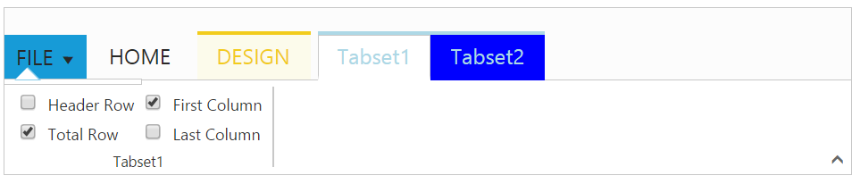

# Contextual Tabs

[`Contextual Tabs`](https://help.syncfusion.com/api/js/ejribbon#members:contextualtabs) are collection of Tabs that extended styling and can be shown based on some criteria. Contextual Tabs can be added like [`tabs`](https://help.syncfusion.com/api/js/ejribbon#members:tabs) including groups and content section. You can set [`backgroundColor`](https://help.syncfusion.com/api/js/ejribbon#members:contextualtabs-backgroundcolor) and [`borderColor`](https://help.syncfusion.com/api/js/ejribbon#members:contextualtabs-bordercolor) to highlight them as Tab set.
Contextual tabs can be added or set dynamically in ribbon control using [`addContextualTabs`](https://help.syncfusion.com/api/js/ejribbon#methods:addcontextualtabs) with it's object and index position.



    <body ng-controller="RibbonCtrl">
    <ul id="ribbonmenu">
        <li>
            <a>FILE</a>
            <ul>
                <li><a>New</a></li>
                <li><a>Open</a></li>
                <li><a>Save</a></li>
                <li><a>Save As</a></li>
                <li><a>Print</a></li>
            </ul>
        </li>
    </ul>
    <table id="design" class="e-designtablestyle">
        <tr>
            <td style="width:87px">
                <input type="checkbox" id="check1" /><label for="check1">Header Row</label>
            </td>
            <td>
                <input type="checkbox" id="Check2" checked="checked" /><label for="Check2">First Column</label>
            </td>
        </tr>
        <tr>
            <td>
                <input type="checkbox" id="check4" checked="checked" /><label for="check4">Total Row</label>
            </td>
            <td>
                <input type="checkbox" id="Check5" /><label for="Check5">Last Column</label>
            </td>
        </tr>
    </table>
    

        <e-tabs>
            

                

                

            

        </e-tabs>
        

            

                

                    

                        

                        

                    

                

            

            

                

                    

                        

                            

                        

                    

                    

                        

                        

                    

                

            

        

    

    
    </body>
    


