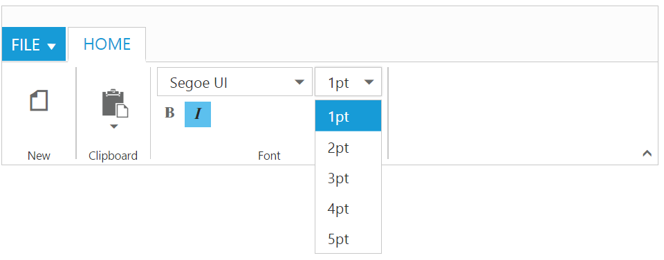
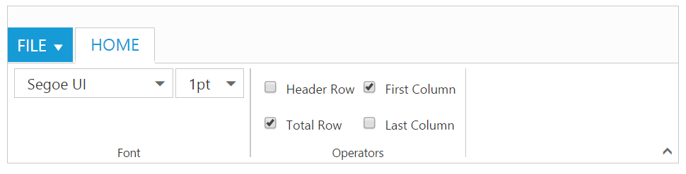

# Controls Support

Button, Split Button, DropdownList, Toggle button, Gallery and Custom controls can be added to each groups. You can set `type` property in group to define the controls. Default `type` is `button`. 

## Built in Controls



	 <body ng-controller="RibbonCtrl">
     <ul id="ribbonmenu">
        <li>
            <a>FILE</a>
            <ul>
                <li><a>New</a></li>
                <li><a>Open</a></li>
                <li><a>Save</a></li>
                <li><a>Save As</a></li>
                <li><a>Print</a></li>
            </ul>
        </li>
    </ul>

    

        <e-tabs>
            

                

                    

                        

                            

                                

                                    

                                    

                                

                            

                        

                    

                    

                        

                            

                                

                                    

                                    

                                

                            

                        

                    

                    

                        

                            

                                

                                    

                                    

                                    

                                    

                                

                            

                            

                                

                                    

                                    

                                

                            

                        

                    

                

            

        </e-tabs>
    

    
    </body>
   


## Custom

You can set `type` as `custom` to render custom controls and Custom element id has to be specified as `contentID`.You can change the element defined in the custom template to appropriate Syncfusion control in the event of Ribbon `create`.



    <body ng-controller="RibbonCtrl">
    <ul id="ribbonmenu">
        <li>
            <a>FILE</a>
            <ul>
                <li><a>New</a></li>
                <li><a>Open</a></li>
                <li><a>Save</a></li>
                <li><a>Save As</a></li>
                <li><a>Print</a></li>
            </ul>
        </li>
    </ul>
    <table id="design" class="e-designtablestyle">
        <tr>
            <td style="width:87px">
                <input type="checkbox" id="check1" /><label for="check1">Header Row</label>
            </td>
            <td>
                <input type="checkbox" id="Check2" checked="checked" /><label for="Check2">First Column</label>
            </td>
        </tr>
        <tr>
            <td>
                <input type="checkbox" id="check4" checked="checked" /><label for="check4">Total Row</label>
            </td>
            <td>
                <input type="checkbox" id="Check5" /><label for="Check5">Last Column</label>
            </td>
        </tr>
    </table>
    

        <e-tabs>
            

                

                    

                        

                            

                                

                                    

                                    

                                

                            

                        

                    

                    

                        

                            

                                

                                    

                                

                            

                        

                    

                

            

        </e-tabs>
    

    
    </body>



