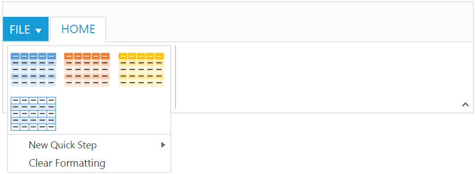

# Gallery

Galleries are used to display items that can be arranged in a grid-type layout. Items in the gallery can be customized as `button`/`menu` to display images, text, or both images and text. You can set `type` of group as `gallery`.

## Gallery Items

`Gallery items` are collection of the items to be included in the main gallery. You can set `text` and `toolTip` to gallery item which can also be customized with `buttonSettings`.
 
Number of `columns` to display in gallery for each row should be specified and the Number of columns in Expanded State `(expandedColumns)` can be customized, if not set, `columns` count will be set as default. 

N> The `itemHeight`and `itemWidth` for gallery item can be set, if not set default values will be used.



    <body ng-controller="RibbonCtrl">
    <ul id="ribbonmenu">
        <li>
            <a>FILE</a>
            <ul>
                <li><a>New</a></li>
                <li><a>Open</a></li>
                <li><a>Save</a></li>
                <li><a>Save As</a></li>
                <li><a>Print</a></li>
            </ul>
        </li>
    </ul>
    

        <e-tabs>
            

                

                    

                        

                            

                                

                                    

                                        

                                            

                                            

                                            

                                            

                                        

                                    

                                

                            

                        

                    

                

            

        </e-tabs>
    

    

    
    </body>



Ribbon Gallery.
{:.caption}

Gallery at Expanded State
{:.caption}

## Custom Gallery Items

`Custom gallery items` are the additional items to be displayed at gallery expanded state. You can set `customItemType` as `button` or `menu`, Default is `button`.

You can also set `text`and `toolTip`to custom gallery item which can also be customized with `buttonSettings`/`menuSettings`based on the `customItemType` specified.



    <body ng-controller="RibbonCtrl">
    <ul id="ribbonmenu">
        <li>
            <a>FILE</a>
            <ul>
                <li><a>New</a></li>
                <li><a>Open</a></li>
                <li><a>Save</a></li>
                <li><a>Save As</a></li>
                <li><a>Print</a></li>
            </ul>
        </li>
    </ul>
    <ul id="extramenu">
        <li>
            <a>New Quick Step</a>
            <ul>
                <li><a>Flag and Move</a></li>
            </ul>
        </li>
    </ul>
    

        <e-tabs>
            

                

                    

                        

                            

                                

                                    

                                        

                                            

                                            

                                            

                                            

                                        

                                        

                                            

                                            

                                        

                                    

                                

                            

                        

                    

                

            

        </e-tabs>
    

    
    
    </body>



