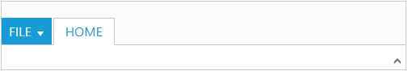
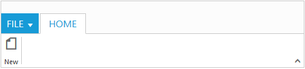

# Getting Started

Before we start with the Ribbon, please refer [this page](http://help.syncfusion.com/js/angularjs) page for general information regarding integrating Syncfusion widget’s.

## Adding JavaScript and CSS references

To render the Ribbon control, the following list of external dependencies are needed, 

* [jQuery](http://jquery.com) - 1.7.1 and later versions
* [Angular](https://angularjs.org/) - angular latest versions

The required angular script as `angular.min.js` and `ej.widget.angular.min.js` which can be available in below [CDN](/js/cdn) links:

* `angular.min.js` - [http://cdn.syncfusion.com/js/assets/external/angular.min.js](http://cdn.syncfusion.com/js/assets/external/angular.min.js)
* `ej.widget.angular.min.js` - [http://cdn.syncfusion.com/{{ site.releaseversion }}/js/common/ej.widget.angular.min.js](http://cdn.syncfusion.com/14.3.0.49/js/common/ej.widget.angular.min.js)

The other required internal dependencies are tabulated below,

 <table>
        <tr>
            <th>
                <b>Files</b>
            </th>
            <th>
                <b>Description/Usage </b>
            </th>
        </tr>
        <tr>
            <td>ej.core.min.js
            </td>
            <td>Must always be referred to before using all the <i><b>JS</b></i> controls.
            </td>
        </tr>
        <tr>
            <td>ej.data.min.js
            </td>
            <td>Used to handle data manger operation and should be used while binding data to <i><b>JS</b></i> controls.
            </td>
        </tr>
        <tr>
            <td>ej.globalize.min.js
            </td>
            <td>Must be referred to localize any of the JS control's text and content.
            </td>
        </tr>
        <tr>
            <td>ej.ribbon.min.js
            </td>
            <td>Should be referred when using <i><b>Ribbon</b></i><b> </b>control.
            </td>
        </tr>
        <tr>
            <td>ej.menu.min.js
            </td>
            <td>This file is used to render menu in the application tab.
            </td>
        </tr>
        <tr>
            <td>ej.scroller.min.js
            </td>
            <td>This file is used to render scroller in the Ribbon control.
            </td>
        </tr>
        <tr>
            <td>ej.checkbox.min.js
            </td>
            <td>This file is used to render checkboxes in the Ribbon control.
            </td>
        </tr>
        <tr>
            <td>ej.tab.min.js
            </td>
            <td>This file is used to render tabs into the Ribbon control.
            </td>
        </tr>
        <tr>
            <td>ej.dropdownlist.min.js
            </td>
            <td rowspan="4">These files are used to render button,split button,toggle button, and dropdown list controls in the ribbon groups.
            </td>
        </tr>
        <tr>
            <td>ej.splitbutton.min.js
            </td>
        </tr>
        <tr>
            <td>ej.button.min.js
            </td>
        </tr>
        <tr>
            <td>ej.togglebutton.min.js
            </td>
        </tr>
    </table>

N> Ribbon uses one or more sub-controls, therefore refer the `ej.web.all.min.js` (which encapsulates all the `ej` controls and frameworks in a single file) in the application instead of referring all the above specified internal dependencies. 

To get the real appearance of the Ribbon, the dependent CSS file `ej.web.all.min.css` (which includes styles of all the widgets) should also needs to be referred.

So the complete boilerplate code is



    <!DOCTYPE html>
    <html xmlns="http://www.w3.org/1999/xhtml" lang="en" ng-app="RibbonApp">
    <head>
    <meta name="viewport" content="width=device-width, initial-scale=1.0">
    <meta name="description" content="Essential Studio for JavaScript">
    <meta name="author" content="Syncfusion">
    <title>Essential Studio for AngularJS: Ribbon</title>
    <!-- Essential Studio for JavaScript  theme reference -->
    <link href="http://cdn.syncfusion.com/{{ site.releaseversion }}/js/web/flat-azure/ej.web.all.min.css" rel="stylesheet" />
    <!-- To load ribbon sample level icons -->
    <link href="http://cdn.syncfusion.com/{{ site.releaseversion }}/js/web/ribbon-css/ej.icons.css" rel="stylesheet" />    
    <!-- Essential Studio for JavaScript  script references -->
    
    
        
    
    
    <!-- Add your custom scripts here -->
    </head>
    <body>
    </body>
    </html>



N> 1. In production, we highly recommend you to use our [`custom script generator`](http://help.syncfusion.com/js/custom-script-generator) to create custom script file with required controls and its dependencies only. Also to reduce the file size further please use [`GZip compression`](https://developers.google.com/web/fundamentals/performance/optimizing-content-efficiency/optimize-encoding-and-transfer?hl=en) in your server.
N> 2. For themes, you can use the `ej.web.all.min.css` CDN link from the code snippet given. To add the themes in your application, please refer to [`this link`](http://help.syncfusion.com/js/theming-in-essential-javascript-components).
N> 3. Ribbon’s sample level icons can be loaded using `ej.icons.CSS` from [this](http://cdn.syncfusion.com/{{ site.releaseversion }}/js/web/ribbon-css/ej.icons.css) CDN or from the location **(installed location)**\ Syncfusion\Essential Studio\{{ site.releaseversion }}\JavaScript\assets\css\web\ribbon-css”.

## Control Initialization

All the Essential JavaScript directives have been encapsulated into a single module called `ejangular` so the first step would be to declare dependency for this module within your AngularJS application.

The Ribbon can be created using `ej-ribbon` AngularJS directive and its properties can be defined using `e-` prefix followed by the property name.(For example, e-width)

Ribbon can be initialized with `Application Tab` and UL list is needed for binding menu to application menu which can be specified through `e-applicationtab-menuItemID` which denotes `id` of UL.

Define the Application Tab with `e-applicationtab-type` as `menu` to render simple Ribbon control.

The code example for defining controls in AngularJS is as follows,



    <html xmlns="http://www.w3.org/1999/xhtml" lang="en" ng-app="RibbonApp">
    <head>
        <title>Essential Studio for AngularJS: Ribbon</title>
    </head>
    <body ng-controller="RibbonCtrl">
    <ul id="ribbonmenu">
        <li><a>FILE</a>
            <ul>
                <li><a>New</a></li>
                <li><a>Open</a></li>
                <li><a>Save</a></li>
                <li><a>Print</a></li>
            </ul>
        </li>
    </ul>
    

    

    
    </body>
    </html>



N> Set the required `e-width` to Ribbon, else default parent container or window width will be considered.

## Adding Tabs

Tab is a set of related groups which are combined into single item. For creating Tab, `e-id` and `e-text` properties should be specified.



    <html xmlns="http://www.w3.org/1999/xhtml" lang="en" ng-app="RibbonApp">
    <head>
        <title>Essential Studio for AngularJS: Ribbon</title>
    </head>
    <body ng-controller="RibbonCtrl">
    <ul id="ribbonmenu">
        <li><a>FILE</a>
            <ul>
                <li><a>New</a></li>
                <li><a>Open</a></li>
                <li><a>Save</a></li>
                <li><a>Print</a></li>
            </ul>
        </li>
    </ul>
    

        <e-tabs>
            <e-tab e-id="home" e-text="Home"></e-tab>
        </e-tabs>
    

    
    </body>
    </html>



## Configuring Groups

List of controls are combined as logical `e-groups` into Tab. Group alignment type as `row/column`, Default is `row`. 

Create group item with `e-text` specified and add content group to Groups collection with ejButton control settings.



    <html xmlns="http://www.w3.org/1999/xhtml" lang="en" ng-app="RibbonApp">
    <head>
        <title>Essential Studio for AngularJS: Ribbon</title>
    </head>
    <body ng-controller="RibbonCtrl">
    <ul id="ribbonmenu">
        <li><a>FILE</a>
            <ul>
                <li><a>New</a></li>
                <li><a>Open</a></li>
                <li><a>Save</a></li>
                <li><a>Print</a></li>
            </ul>
        </li>
    </ul>
    

        

            

                

                    

                        

                            

                                

                                    
                                        
                                    

                                

                            

                        

                    

                

            

        

    

    
    </body>
    </html>



## Adding Controls to Group

Syncfusion JavaScript Controls can be added to group’s content with corresponding `type` specified like button, split button, toggle button, dropdown list, gallery, custom, etc. Default type is `button`.



    <html xmlns="http://www.w3.org/1999/xhtml" lang="en" ng-app="RibbonApp">
    <head>
        <title>Essential Studio for AngularJS: Ribbon</title>
    </head>
    <body ng-controller="RibbonCtrl">
    <ul id="ribbonmenu">
        <li><a>FILE</a>
            <ul>
                <li><a>New</a></li>
                <li><a>Open</a></li>
                <li><a>Save</a></li>
                <li><a>Print</a></li>
            </ul>
        </li>
    </ul>
    <ul id="split">
        <li>Paste</li>
    </ul>
    

            

                

                    

                        

                            

                                

                                    

                                        
                                        
                                        

                                    

                                

                            

                        

                        

                            

                                

                                    

                                        

                                    
                                    

                                

                                

                                    

                                        

                                    

                                

                            

                        

                    

                

            

        

        
        </body>
        </html>



N> The control can be render using `ej.web.all.min.js` and angular related references are referred from `ej.widget.angular.min.js` to render the control.

## User Interface

Ribbon component able to integrate any custom components and customized their functionality in application end. Our Ribbon component is similar to Microsoft products(Word). The Ribbon UI consists of several sections like Application Tab, Quick Access Toolbar, Tab, Contextual Tab, Gallery and etc.The following screenshot shows the diagrammatic detail of Ribbon UI:

From above screenshot, you can see Ribbon has several subcomponents for different functionalities. The upcoming sections explains the brief details of each functionalities and their customizations.
