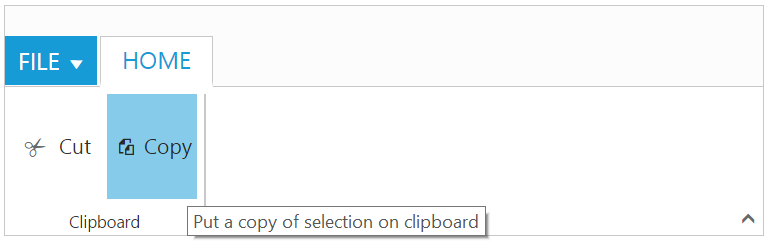
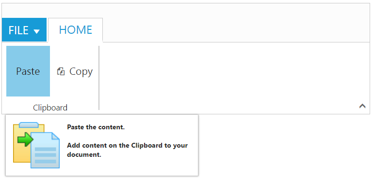
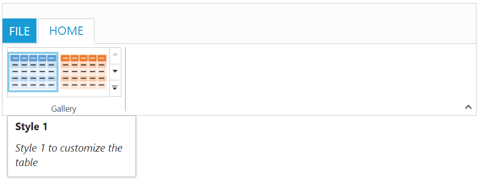

# Screen Tips

ScreenTip/Tooltip is used to reduce the controls related Help that are needed to the end user to do control related actions.

## HTML Tooltip

Standard `html tooltip` can be set using `tooltip` property of each group item.



    <body ng-controller="RibbonCtrl">
    <ul id="ribbonmenu">
        <li>
            <a>FILE</a>
            <ul>
                <li><a>New</a></li>
                <li><a>Open</a></li>
                <li><a>Save</a></li>
                <li><a>Save As</a></li>
                <li><a>Print</a></li>
            </ul>
        </li>
    </ul>
    

        <e-tabs>
            

                

                    

                        

                            

                                

                                    

                                    

                                    

                                    

                                

                            

                        

                    

                

            

        </e-tabs>
    

    
    </body>



## Custom Tooltip

Custom Tooltip is used to set detailed help to the user about the controls. You can set `title`, `content` and `prefixIcon` class to customize the tooltip with icons.

### For Groups 

`Custom tooltip` for each group controls can be specified. Such as to the controls button, split button, dropdown list etc.



    <body ng-controller="RibbonCtrl">
    <ul id="ribbonmenu">
        <li>
            <a>FILE</a>
            <ul>
                <li><a>New</a></li>
                <li><a>Open</a></li>
                <li><a>Save</a></li>
                <li><a>Save As</a></li>
                <li><a>Print</a></li>
            </ul>
        </li>
    </ul>
    

        <e-tabs>
            

                

                    

                        

                            

                                

                                    
Paste the content.  Add content on the Clipboard to your document.<&#47;h6>" e-customtooltip-prefixicon="e-pastetip" e-buttonsettings-contenttype="textandimage">
                                    

                                    

                                    

                                

                            

                        

                    

                

            

        </e-tabs>
    

    
    
    </body>



### For Gallery

`Custom tooltip` for each `gallery` and `custom gallery` items button control can be specified. 

N> Custom gallery item `menu` is not supported to Custom tooltip.



     <body ng-controller="RibbonCtrl">
    <ul id="ribbonmenu">
        <li>
            <a>FILE</a>
        </li>
    </ul>
    

        <e-tabs>
            

                

                    

                        

                            

                                

                                    

                                        

                                            
Style 1 to customize the table<i>" e-buttonsettings-contenttype="imageonly" e-buttonsettings-prefixicon="e-icon e-gallerycontent1 e-gbtnimg" e-buttonsettings-cssclass="e-gbtnposition">

                                            
Style 2 to customize the table<i>" e-buttonsettings-contenttype="imageonly" e-buttonsettings-prefixicon="e-icon e-gallerycontent2 e-gbtnimg" e-buttonsettings-cssclass="e-gbtnposition">

                                            
Style 3 to customize the table<i>" e-buttonsettings-contenttype="imageonly" e-buttonsettings-prefixicon="e-icon e-gallerycontent3 e-gbtnimg" e-buttonsettings-cssclass="e-gbtnposition">

                                            
Style 4 to customize the table<i>" e-buttonsettings-contenttype="imageonly" e-buttonsettings-prefixicon="e-icon e-gallerycontent4 e-gbtnimg" e-buttonsettings-cssclass="e-gbtnposition">

                                        

                                    

                                

                            

                        

                    

                

            

        </e-tabs>
    

    

    
    </body>



### For Expand Pin

Specifies the `custom tooltip` for expand pin in the Ribbon. 



    <body ng-controller="RibbonCtrl">
    <ul id="ribbonmenu">
        <li>
            <a>FILE</a>
            <ul>
                <li><a>New</a></li>
            </ul>
        </li>
    </ul>
    
Click the icon to collapse the Ribbon.<&#47;h6>" e-applicationtab-type="menu" e-applicationtab-menuitemid="ribbonmenu">
        <e-tabs>
            

                

                    

                        

                            

                                

                                    
New.<&#47;h6>" e-buttonsettings-contenttype="imageonly" e-buttonsettings-imageposition="imagetop" e-buttonsettings-prefixicon="e-icon e-ribbon e-new" e-buttonsettings-click="executeAction">
                                    

                                

                            

                        

                    

                

            

        </e-tabs>
    

    
     </body>
     


### For Collapse Pin

Specifies the `custom tooltip` for collapse pin in the Ribbon. 



    <body ng-controller="RibbonCtrl">
    <ul id="ribbonmenu">
        <li>
            <a>FILE</a>
            <ul>
                <li><a>New</a></li>
            </ul>
        </li>
    </ul>
    
Keep it open while you work.<&#47;h6>" e-applicationtab-type="menu" e-applicationtab-menuitemid="ribbonmenu">
        <e-tabs>
            

                

                    

                        

                            

                                

                                    
New.<&#47;h6>" e-buttonsettings-contenttype="imageonly" e-buttonsettings-imageposition="imagetop" e-buttonsettings-prefixicon="e-icon e-ribbon e-new" e-buttonsettings-click="executeAction">
                                    

                                

                            

                        

                    

                

            

        </e-tabs>
    

    
    
</body>



### For GroupExpander

`Custom tooltip` for each group expander can be specified.



    <body ng-controller="RibbonCtrl">
    <ul id="ribbonmenu">
        <li>
            <a>FILE</a>
            <ul>
                <li><a>New</a></li>
            </ul>
        </li>
    </ul>
    

        <e-tabs>
            

                

                    
Show a popup for the Clipboard group.<&#47;h6>" e-aligntype="rows">
                        

                            

                                

                                    

                                    

                                

                            

                        

                    

                

            

        </e-tabs>
    

    
    </body>



