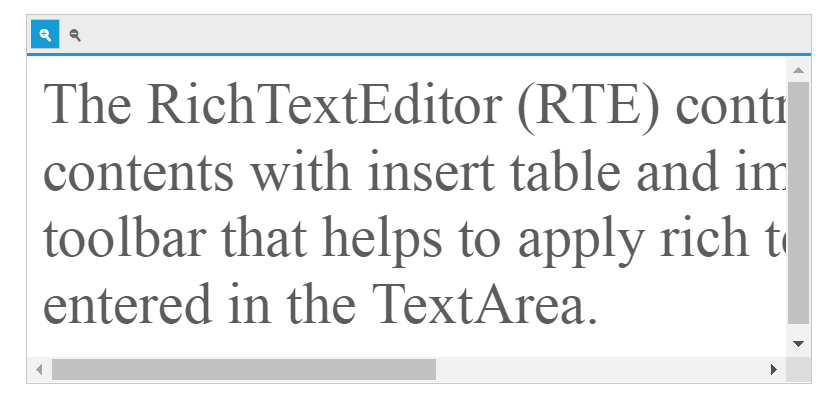

# Zoom

The editor provides zoom tools which enlarges the view of an editor's object enabling you to see more detail. You can continuous zoomIn and zoomOut either using zoom tools or keyboard.

You can assign Increases and decreases of zooming range using [zoomStep](http://help.syncfusion.com/api/js/ejrte#members:zoomStep) property



<textarea id="texteditor" ej-rte e-value="val" e-toolslist="toolsList" e-tools="tools" e-zoomstep="zoomStep"></textarea>



# Print

The editor provides print tools which use to print the contents of the editor.



    <textarea id="texteditor" ej-rte e-value="val" e-toolslist="toolsList" e-tools="tools"></textarea>

    


