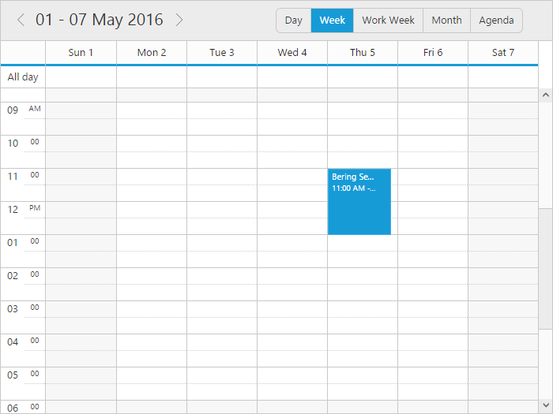

# Getting Started

The AngularJS directives are usually included within the `ej.widget.angular.min.js` file and all these directives are usually packed together in a common module known as `ejangular`. For basic details on how to configure Syncfusion widgets in AngularJS framework, refer [here](https://help.syncfusion.com/js/angularjs).

To get start with the Schedule control in AngularJS framework, the following list of external dependencies are mandatory, 

* [jQuery](http://jquery.com) - 1.7.1 and later versions
* [jsRender](https://github.com/borismoore/jsrender) - to render the templates
* [AngularJS](https://angularjs.org/)

The external AngularJS script file `angular.min.js` can also be accessed from the following installed location - 

* **(installed location)**\Syncfusion\Essential Studio\{{ site.releaseversion }}\JavaScript\assets\external

An another mandatory script is `ej.widget.angular.min.js`, which can be accessed from the specified location - 

* **(installed location)**\Syncfusion\Essential Studio\{{ site.releaseversion }}\JavaScript\assets\scripts\common

The other required internal dependencies of Scheduler are tabulated below,

<table>
<tr>
<th>
File  </th><th>
Description/Usage  </th></tr>
<tr>
<td>
ej.core.min.js  </td><td>
Must be referred always first before using all the JS controls.  </td></tr>
<tr>
<td>
ej.data.min.js  </td><td>
Used to handle data operation and should be used while binding data to JS controls.  </td></tr>
<tr>
<td>
ej.globalize.min.js  </td><td>
Must be referred to localize any of the JS control's text and content.  </td></tr>
<tr>
<td>
ej.schedule.min.js  </td><td>
Schedule core script file which includes schedule related scripts files such as <i>ej.schedule.render.js</i>, <i>ej.schedule.resources.js</i> and <i>ej.schedule.horizontal.js</i>  </td></tr>
<tr>
<td>
ej.scroller.js  ej.touch.js  ej.draggable.js  ej.navigationdrawerbase.js  ej.listviewbase.js  ej.listview.js  ej.recurrenceeditor.js  ej.dropdownlist.js  ej.radiobutton.js  ej.dialog.js  ej.button.js  ej.autocomplete.js  ej.datepicker.js  ej.timepicker.js  ej.checkbox.js  ej.editor.js  ej.menu.js  ej.navigationdrawer.js  ej.tooltip.js  </td><td>
These files are referred for proper working of the sub-controls used within Scheduler.  </td></tr>
</table>

N> Scheduler uses one or more sub-controls, therefore refer the `ej.web.all.min.js` (which encapsulates all the `ej` controls and frameworks in a single file) in the application instead of referring all the above specified internal dependencies. 

To get the real appearance of the Scheduler, the dependent CSS file `ej.web.all.min.css` (which includes styles of all the widgets) should also needs to be referred.

## Script/CSS Reference

Create a new HTML file and include the below initial code.



<!DOCTYPE html>
<html lang="en" xmlns="http://www.w3.org/1999/xhtml">
    <head>
        <meta charset="utf-8" />
        <title> </title>
    </head>
    <body>
    </body>
</html>



Refer the CSS file from the specific theme folder to your HTML file within the head section as shown below. Refer the built-in available themes from [here](https://help.syncfusion.com/js/theming-in-essential-javascript-components).



<head>
    <meta charset="utf-8" />
    <title>Getting Started - Schedule</title>
    <link href="http://cdn.syncfusion.com/{{ site.releaseversion }}/js/web/flat-azure/ej.web.all.min.css" rel="stylesheet" />
</head>



Add links to the [CDN](https://help.syncfusion.com/js/cdn) Script files with other required external dependencies.



<head>
    <meta charset="utf-8" />
    <title>Getting Started - Schedule</title>
    <link href="http://cdn.syncfusion.com/{{ site.releaseversion }}/js/web/flat-azure/ej.web.all.min.css" rel="stylesheet" />
    
    
    
	
	
</head>



N> Uncompressed version of the script files are also available, which is used for development or debugging purpose and can be generated from the custom script [here](http://csg.syncfusion.com).

## Control Initialization

Create the Schedule control using `ej-schedule` directive and define all its other properties prefixed with `e-` as shown in the below code -



<html xmlns="http://www.w3.org/1999/xhtml" ng-app="ScheduleApp">

<body>
	

		<ej-schedule id="Schedule1" e-width="100%" e-height="525px" e-currentview="currentView" e-currentdate="setDate">
	    </ej-schedule>
	

</body>

</html>



In the above code example, `currentView` and `setDate` are the scope variables defined, in order to enable the two-way binding. Therefore, refer the below code example to know how to enable the model binding.



<html xmlns="http://www.w3.org/1999/xhtml" ng-app="ScheduleApp">
<head> <!-- Dependency file references --> </head>
<body>
	

		<ej-schedule id="Schedule1" e-width="100%" e-height="525px" e-currentview="currentView" e-currentdate="setDate">
	    </ej-schedule>
	

    
</body>

</html>



The Scheduler properties that supports **two-way binding** are as follows - 

<table>
	<tr>
	<th>Properties</th>
	<th>Usage</th>
	</tr>
	<tr>
	<td>currentView</td>
	<td>sets the specific view on the Scheduler</td>
	</tr>
	<tr>
	<td>currentDate</td>
	<td>sets the specific date on the Scheduler</td>
	</tr>
	<tr>
	<td>fields.dataSource</td>
	<td>Sets the Scheduler dataSource</td>
	</tr>
</table>	

## Binding Appointment Data

Set the Scheduler `dataSource` with a set of local JSON data by passing it through the scope variable `appointments` - 



<html xmlns="http://www.w3.org/1999/xhtml" ng-app="ScheduleApp">
<head> <!-- Dependency file references --> </head>
<body>
	

		<ej-schedule id="Schedule1" e-width="100%" e-height="525px" e-currentview="currentView" e-currentdate="setDate"
            e-appointmentsettings-datasource="appointments" 
			e-appointmentsettings-id="Id" 
			e-appointmentsettings-subject="Subject" 
			e-appointmentsettings-starttime="StartTime"
			e-appointmentsettings-endtime="EndTime" 
			e-appointmentsettings-description="Description" 
			e-appointmentsettings-allday="AllDay" 
			e-appointmentsettings-recurrence="Recurrence" 
			e-appointmentsettings-recurrencerule="RecurrenceRule">
	    </ej-schedule>
	

</body>

</html>



N> Other than the local JSON data, Scheduler `dataSource` can also be set with remote data services which is accessed through the help of `ejDataManager` instances.

The Scheduler displays as shown in the below image - 

## Mapper Fields

It is mandatory to map the appointment fields with the appropriate column names from the dataSource. For example, if the local appointment data is defined with specific column names as below - 





Those above specified field names of appointment data must be mapped accurately with the Scheduler `appointmentsettings` fields as shown below - 



	

		<ej-schedule id="Schedule1" e-width="100%" e-height="525px" e-currentview="currentView" e-currentdate="setDate"
            e-appointmentsettings-datasource="appointments" 
			e-appointmentsettings-id="AppId" 
			e-appointmentsettings-subject="AppSubject" 
			e-appointmentsettings-starttime="AppStartTime"
			e-appointmentsettings-endtime="AppEndTime" 
			e-appointmentsettings-description="AppDescription" 
			e-appointmentsettings-allday="AllDay" 
			e-appointmentsettings-recurrence="Recurrence" 
			e-appointmentsettings-recurrencerule="RecurrenceRule">
	    </ej-schedule>
	

