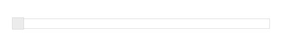
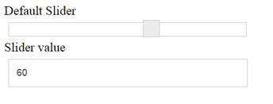

# Getting Started

This section explains briefly about how to create a Slider in your application with **AngularJS**. The following examples shows how to use slider control.

## Create the Slider Widget in AngularJS

Essential JavaScript includes angular directives for all controls with the ej.widget.angular.min.js script file. All the Essential JS directives have been encapsulated into a single module called **ejangular**. To render our ej controls in angular, you need to refer the “angular.min.js” and “ej.widget.angular.min.js” in your application.

Create a new HTML file and include the below code:


<!doctype html>
<html lang="en" ng-app="SliderCtrl">
<head>
    <title>Essential Studio for JavaScript : AngularJS Support for Slider </title>
    <!-- Style sheet for default theme (flat azure) -->
    <link href="http://cdn.syncfusion.com/{{ site.releaseversion }}/js/web/flat-azure/ej.web.all.min.css" rel="stylesheet" />
    <!--Scripts-->
    
    
    
    
    
    <!--Add custom scripts here -->
</head>
<body>
    <!--Add the slider elements here-->
</body>
</html>


The ng-app directive explains the root element (<html> or <body> tags) of the application. You will assign a name to the ng-app directive, then you must create a module with that name. In this module, you will have to define your directives, services, filters and configurations.

Properties can be bind to ejSlider control using the prefix e- and particular property name as shown as below.





To render the ejSlider using angular directive, we need to inject the **ejangular** module with modules.


 


The following screenshot displays a default slider using AngularJS

## Data Binding

The **Slider** supports the data binding. When a widget’s model attribute is bound to a scope variable, it was bound in one way.

We have listed the properties of Slider widget that supports the two way binding:

<table>
<tr>
<td>
Widget  </td><td>
Supported Property  </td></tr>
<tr>
<td>
ejSlider  </td><td>
Value,  values  </td></tr>
</table>
Please use the below code to bind the slider in Two-way binding.



Slider value

<input type="text" name="slider" class="input ejinputtext" ng-model="sliderValue" />




angular.module('sliderApp', ['ejangular']).controller('SliderCtrl', function ($scope) {
$scope.sliderValue = 60;
$scope.width = "300";
$scope.height = "18"
});


In the above sample, Slider value was bind in two way method. Changes made in the slider will reflect to the textbox in vice versa.

Execute the above to render the following output.

