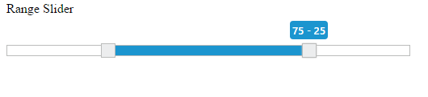

# RTL support

**Slider** includes the Right to Left alignment support. Operations in the **Slider** is performed from Right to Left.

## Enabling RTL

Use the **enableRTL** property to enable the RTL support. By default this property is disabled. Data type of this property is “Boolean”.

The following steps explains you on how to enable RTL support in **Slider**.

In an **HTML** page, specify the **div** elements to render the **Range Slider.**



Range Slider





    angular.module('sliderApp', ['ejangular'])
    .controller('SliderCtrl', function ($scope) {
    $scope.value=[25,75]
    });



Execution of above code will render the following output.

