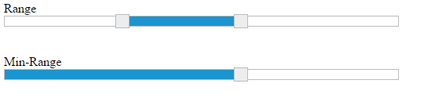

# Slider Types

This feature allows you to specify the type of **Slider**. There are three different types of **Slider**, **Default Slider**, **Min-Range Slider** and **Range Slider**. By default, **Default Slider** renders. You can use the **sliderType** property to choose the type of **Slider**. Data type of this property is “Enum”

Both **Default Slider** and **Min-Range Slider** have same behavior that is used to select a single value. In Min-Range Slider, a shadow is considered from the start value to current handle position. But Range Slider contains two handles that is used to select a range of values and a shadow is considered in between the two handles.

Possible Slider types are as follows,

Property Table for JavaScript

<table>
<tr>
<th>
Property</th><th>
Allowed values</th><th>
Description</th></tr>
<tr>
<td rowspan = "3">
sliderType</td><td>
ej.SliderType.Default (default value)</td><td>
It is the default Slider type. It helps to select a single value. </td></tr>
<tr>
<td>
ej.SliderType.MinRange</td><td>
Use this Slider to select a single value; Displays shadow from the start value to the current value.</td></tr>
<tr>
<td>
ej.SliderType.Range</td><td>
Use this Slider to select a range of values; Displays shadow in-between the selection range.</td></tr>
</table>

The following steps explains you on how to configure the **sliderType** property to display **Range Slider** and **MinRange Slider**.

In an **HTML** page, specify the **div** elements to render the **RangeSlider** and **MinRange** **Slider**.



Range

 
 

Min-Range





    angular.module('sliderApp', ['ejangular'])
    .controller('SliderCtrl', function ($scope) {
    $scope.value = [30, 60]
    });

	


Execute the above code example to render the following output.

 

