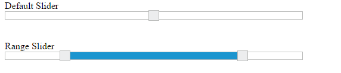

# Updating slider value

**Slider** widget includes an option to specify/update its value. And also you can specify the starting and ending value for the **Slider** using the **minValue** and **maxValue** properties.

## Value

This property is used to set the value in the “Default” and “Min-Range” Sliders. By default its value is null when no value is specified. Data type of this property is “number”.
You can get/set the value in the slider handle by using [getValue](https://help.syncfusion.com/api/js/ejslider#methods:getvalue) and [setValue](https://help.syncfusion.com/api/js/ejslider#methods:setValue) methods.
Also [change](https://help.syncfusion.com/api/js/ejslider#events:change) event will be triggered whenever **Slider** value is changed.

## Values

This property is used to set the value in “Range Slider”. By default range values is from 0 to 100. This property is of “Array” data type.

The following steps explains you the configuration of “value” and “values” property.

In an **HTML** page, specify the **
** elements to render the “Range Slider” and “Default Slider”.



  
Default Slider

 
 

range Slider





    angular.module('sliderApp', ['ejangular'])
    .controller('SliderCtrl', function ($scope) {
    $scope.value = [20, 80]
    });



Execute the above code example to render the following output.

 

## MinValue

To set the minimum/starting value of the Slider, you can use the minValue property. By default its value is 0. Data type of this property is “number”.

## MaxValue

To set the maximum/ending value of the Slider, you can use the maxValue property. By default its value is 100. Data type of this property is “number”.

The following steps explains you on how to configure minValue and maxValue property.

In an **HTML** page, specify the **
** elements to render the **Default Slider** and **Range Slider**.



Default Slider

 
 

Range Slider





    angular.module('sliderApp', ['ejangular'])
    .controller('SliderCtrl', function ($scope) {
    $scope.value = [10, 90]
        });



Execute the above code example to render the following output.

 

In the above example, for **Default Slider** the slider value starts from “40” (min value) and ends in “80” (max value), so the slider handle is placed at the center of the Slider while specifying the value as “60”.

For **Range Slider**, the value starts from “10” (min value) and ends in “90” (max value). The range shadow occupies the entire **Slider**, since the range (values) is specified as “[10, 90]”.

## Buttons

**Slider** includes the button support for increment or decrement the values of the slider.

### Enabling Buttons

Use the **showButtons** property to enable the button support. By default this property is disabled. Data type of this property is “Boolean”.

The following steps explains you on how to enable button support in **Slider**.

In an **HTML** page, specify the **div** elements to render the **Range Slider.**



   
Range Slider

   

                        





    angular.module('sliderApp', ['ejangular'])
    .controller('SliderCtrl', function ($scope) {
    $scope.values = [30, 60];
    $scope.width = "500";
    });



Execute the above code example to render the following output.

