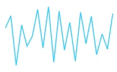

# Getting Started

This section explains you the steps required to populate the Sparkline with data. This section covers only the minimal features that you need to know to get started with the Sparkline.

## Adding script reference

Create an **HTML** page and add the scripts references in the order mentioned in the following code example.



<!DOCTYPE html>
    <html xmlns="http://www.w3.org/1999/xhtml" lang="en" ng-app="SparkApp">
    <head>
    <title>Essential Studio for AngularJS: Sparkline</title>
    <!-- Essential Studio for JavaScript  theme reference -->
    <link href="http://cdn.syncfusion.com/{{ site.releaseversion }}/js/web/flat-azure/ej.web.all.min.css" rel="stylesheet" />
    <!-- Essential Studio for JavaScript  script references -->
    
        
    
    
    <!-- Add your custom scripts here -->
    </head>
    <body ng-controller="SparkCtrl">
    </body>
    </html>



In the above code, ej.web.all.min.js script reference has been added for demonstration purpose. It is not recommended to use this for deployment purpose, as its file size is larger since it contains all the widgets. Instead, you can use ['CSG'](http://csg.syncfusion.com/) utility to generate a custom script file with the required widgets for deployment purpose.

## Initialize Sparkline

Add a **div** container to render the Sparkline.



<body ng-controller="SparkCtrl">
    

    

</body>



Initialize the Sparkline by using the ej-sparkline attribute. The Sparkline is rendered to the container with default size. You can also customize the Sparkline dimension by setting the width and height.



<body ng-controller="SparkCtrl">
    

    

    
</body>



Now, the Sparkline is rendered with some auto-generated random values and with default Line type. 

