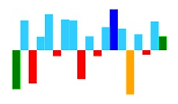

## Point Customization

You can customize points by initializing the point colors. The customization options allow you to differentiate the first,last,highest,lowest and negative value  points. This customization only applicable for line, column and area type Sparkline.


<html xmlns="http://www.w3.org/1999/xhtml" lang="en" ng-app="SparklineApp">
    <head>
        <title>Essential Studio for AngularJS: Sparkline</title>
        <!--CSS and Script file References -->
    </head>
  <body ng-controller="SparkCtrl">
    

    <ej-sparkline e-type="column" e-negativePointColor="red" e-highPointColor = "blue"
    e-lowPointColor = "orange" e-startPointColor = "green" e-endPointColor ="green">
    </ej-sparkline>
    

    
    </body>
</html>



