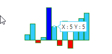
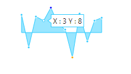

# Sparkline Customization

This section explains you the customization options available to make changes in the Sparkline for getting better appearance.

## Sparkline background

You can specify the background color for the Sparkline using `e-background` property. When you don't specify the background, it takes "transparent" as background color. 



<body ng-controller="SparkCtrl">
    

        <ej-sparkline e-background="gray"></ej-sparkline>
    

    
</body>

 

## Stroke color and width

You can customize the series border color and width using `e-stroke` and `e-width`. This is applicable for Sparkline types line and area.



<body ng-controller="SparkCtrl">
    

        <ej-sparkline e-stroke="green" e-width="3"></ej-sparkline>
    

    
</body>

 

## Sparkline border

You can customize the `e-border` width and height of the Sparkline using `e-border-width` and `e-border-color` properties. This is applicable for column, win-loss and pie series.



<body ng-controller="SparkCtrl">
    

        <ej-sparkline e-border-color="green" e-border-width="2"></ej-sparkline>
    

    
</body>

 

## Opacity

By default `e-opacity` of the Sparkline is 1. You can specify the opacity value from 0 to 1. This is applicable for all types of series. 



<body ng-controller="SparkCtrl">
    

        <ej-sparkline e-opacity="0.5"></ej-sparkline>
    

    
</body>

 

## Localization

Sparkline is having support for localization as well. Default culture is "en-US". You can modify the culture using the property `e-locale`.



<body ng-controller="SparkCtrl">
    

        <ej-sparkline e-locale="fr-FR"></ej-sparkline>
    

    
</body>

 

## Padding for Sparkline

`e-padding` is used to specify the padding value between the container and Sparkline. By default padding value of the Sparkline is 5. 



<body ng-controller="SparkCtrl">
    

        <ej-sparkline e-padding="20"></ej-sparkline>
    

    
</body>

 

## Canvas support

You can control whether Sparkline has to be rendered as SVG or Canvas. `e-enablecanvasrendering` rendering supports all the functionalities supported in SVG rendering.



<body ng-controller="SparkCtrl">
    

        <ej-sparkline e-enablecanvasrendering="true"></ej-sparkline>
    

    
</body>

 

## Themes

You can specify different `e-theme` for Sparkline control.



<body ng-controller="SparkCtrl">
    

        <ej-sparkline e-theme="flatdark"></ej-sparkline>
    

    
</body>

 

