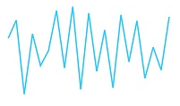
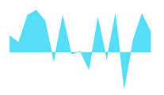
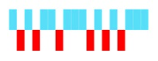
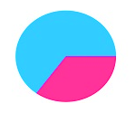

# Sparkline Types

## Line Type

To render a Line type Sparkline, set the `e-type` as **line**. To change the color and width of the line, you can use the `e-fill` and `e-width` property.	



<html xmlns="http://www.w3.org/1999/xhtml" lang="en" ng-app="SparklineApp">
    <head>
        <title>Essential Studio for AngularJS: Sparkline</title>
        <!--CSS and Script file References -->
    </head>
  <body ng-controller="SparkCtrl">
    

    <ej-sparkline e-width="3" e-fill="#33ccff"></ej-sparkline>
    

    
</body>
</html>



## Column Type

To render a Column Sparkline, set the type as **column** To change the color of the column, you can use the `e-fill` property.



<html xmlns="http://www.w3.org/1999/xhtml" lang="en" ng-app="SparklineApp">
    <head>
        <title>Essential Studio for AngularJS: Sparkline</title>
        <!--CSS and Script file References -->
    </head>
  <body ng-controller="SparkCtrl">
    

    <ej-sparkline e-type="column" e-fill="#33ccff"></ej-sparkline>
    

    
    </body>
</html>



## Area Type

To render an Area Sparkline, you can specify the type as **area**. To change the Area color, you can use the `e-fill` property



<html xmlns="http://www.w3.org/1999/xhtml" lang="en" ng-app="SparklineApp">
    <head>
        <title>Essential Studio for AngularJS: Sparkline</title>
        <!--CSS and Script file References -->
    </head>
  <body ng-controller="SparkCtrl">
    

    <ej-sparkline e-type="area" e-fill="#69D2E7"></ej-sparkline>
    

    
    </body>
</html>



## WinLoss Type

WinLoss Sparkline render as a column segment and it show the positive, negative and neutral values. You can customize the positive and negative color of the win-loss type.



<html xmlns="http://www.w3.org/1999/xhtml" lang="en" ng-app="SparklineApp">
    <head>
        <title>Essential Studio for AngularJS: Sparkline</title>
        <!--CSS and Script file References -->
    </head>
  <body ng-controller="SparkCtrl">
    

    <ej-sparkline e-type="winloss" e-fill="#69D2E7"></ej-sparkline>
    

    
    </body>
</html>



## Pie Type

You can create a pie type sparkline by setting the type as **pie**. Colors for the pie can be customize using `e-palette` property.



<html xmlns="http://www.w3.org/1999/xhtml" lang="en" ng-app="SparklineApp">
    <head>
        <title>Essential Studio for AngularJS: Sparkline</title>
        <!--CSS and Script file References -->
    </head>
  <body ng-controller="SparkCtrl">
    

    <ej-sparkline e-type="pie" e-palette="palette"></ej-sparkline>
    

    
   </body>
</html>



