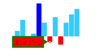

## Tooltip  

A [`tooltip`](../api/ejsparkline#members:tooltip) follows the pointer movement and is used to indicate the value of a point. This feature is applicable for line, column, pie, and area Sparkline. You can enable the tooltip by setting it's [`visible`](../api/ejsparkline#members:tooltip-visible) property as **true**.



<html xmlns="http://www.w3.org/1999/xhtml" lang="en" ng-app="SparklineApp">
    <head>
        <title>Essential Studio for AngularJS: Sparkline</title>
        <!--CSS and Script file References -->
    </head>
  <body ng-controller="SparkCtrl">
    

    <ej-sparkline e-tooltip-visible="true" ></ej-sparkline>
    

    
    </body>
</html>



## Tooltip Customization

You can customize the tooltip [`fill color`](../api/ejsparkline#members:tooltip-fill), [`border`](../api/ejsparkline#members:tooltip-border) properties [`border color`](../api/ejsparkline#members:tooltip-border-color), [`border width`](../api/ejsparkline#members:tooltip-border-width) and [`font`](../api/ejsparkline#members:tooltip-font) properties [`color`](../api/ejsparkline#members:tooltip-font-color), [`font family`](../api/ejsparkline#members:tooltip-font-fontfamily), [`font style`](../api/ejsparkline#members:tooltip-font-fontstyle), [`font weight`](../api/ejsparkline#members:tooltip-font-fontweight), [`opacity`](../api/ejsparkline#members:tooltip-font-opacity), [`size`](../api/ejsparkline#members:tooltip-font-size)



<html xmlns="http://www.w3.org/1999/xhtml" lang="en" ng-app="SparklineApp">
    <head>
        <title>Essential Studio for AngularJS: Sparkline</title>
        <!--CSS and Script file References -->
    </head>
  <body ng-controller="SparkCtrl">
    

    <ej-sparkline e-tooltip="tooltip" ></ej-sparkline>
    

    
    </body>
</html>



## Tooltip Template   

HTML elements can be displayed in the tooltip by using the [`template`](../api/ejsparkline#members:tooltip-template) option of the tooltip. The template option takes the value of the id attribute of the HTML element. You can use the **#point.x#** and **#point.y#** as place holders in the HTML element to display the x and y values of the corresponding point.



<html xmlns="http://www.w3.org/1999/xhtml" lang="en" ng-app="SparklineApp">
    <head>
        <title>Essential Studio for AngularJS: Sparkline</title>
        <!--CSS and Script file References -->
    </head>
  <body ng-controller="SparkCtrl">
  

    

        
#point.x#

        
#point.y#

    

    

    <ej-sparkline e-tooltip-visible="true" e-tooltip-template="item"></ej-sparkline>
    

    
    </body>
</html>



