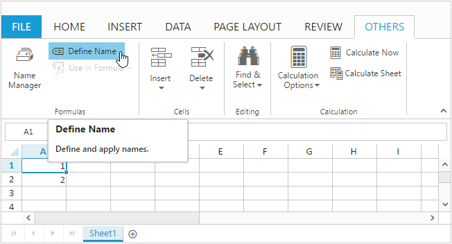

# Formulas

Formulas are used for calculation of data in sheet. You can refer the formula cell reference in following ways,

1. Cell reference from same sheet
2. Cell reference from different sheets

You can set formula for a `cell` in following ways,

1. Initial Load
2. Method
3. User Interface

### Initial Load

You can set formula for a cell by specifying `value` property in cell data binding. The following code example describes the above behavior,



<body ng-controller="SpreadsheetCtrl">
     

</body>




var syncApp = angular.module("defaultApp", ["ngRoute", "ejangular"]);
    syncApp.controller('SpreadsheetCtrl', function ($scope,$rootScope) {
         $scope.sheetData = [{
                rows: [{
                    cells: [{
                        value: 1
                    }]
                },
                {
                    cells: [{
                        value: 2
                    }]
                },
                {
                    cells: [{
                        value: "=SUM(A1,A2)"
                    }]
                }]
            },
            {
                rows: [{
                    cells: [{
                        value: "=SUM(Sheet1!A1:A2)"
                    }]
                }]
            }];
     });



The following output is displayed as a result of the above code example.

Cell Reference from Same sheet
{:.caption}

Cell Reference from different sheets
{:.caption}

### Method

You can set formula for a cell using [`updateCellValue`](https://help.syncfusion.com/api/js/ejspreadsheet#methods:xledit-updatecellvalue "updateCellValue") method. The following code example describes the above behavior,



<body ng-controller="SpreadsheetCtrl">
     

</body>




var syncApp = angular.module("defaultApp", ["ngRoute", "ejangular"]);
     syncApp.controller('SpreadsheetCtrl', function ($scope,$rootScope) {
         $scope.sheetData = [{
                rows: [{
                    cells: [{
                        value: 1
                    }]
                },
                {
                    cells: [{
                        value: 2
                    }]
                }]
            }];
            $scope.loadComplete = loadComplete;
     });

    function loadComplete() {
        this.XLEdit.updateCellValue({ rowIndex: 2, colIndex: 0 }, "=SUM(A1,A2)");
    }



The following output is displayed as a result of the above code example.

### User Interface

You can set formula for a cell by edit and save a cell through user interface using `Editing` feature. The following code example and screenshot describes the above behavior,



<body ng-controller="SpreadsheetCtrl">
     

</body>




var syncApp = angular.module("defaultApp", ["ngRoute", "ejangular"]);
    syncApp.controller('SpreadsheetCtrl', function ($scope,$rootScope) {
         $scope.sheetData = [{
               rows: [{
                    cells: [{
                        value: 1
                    }]
                },
                {
                    cells: [{
                        value: 2
                    }]
                }]
            }];
     });



The following output is displayed while saving edited cell with above code example.

N> 1. The list of supported formulas can be find in following [`link`](https://help.syncfusion.com/js/calculate/supported-formulas/supported-formulas "link")
N> 2. Constant values, cell references, formulas and named ranges can be passed as argument to formulas
N> 3. Selection can be used to mention cell references within formula

## Named Ranges

To understand the purpose of cell reference or table, you can define a meaningful name using named ranges support. By using names, you can make your formula much easier to understand and maintain. You can add named ranges to Spreadsheet in following ways,
    
1. Initial Load

2. Method

3. User Interface

### Initial Load

To add named ranges at initial load by using [`nameManager`](https://help.syncfusion.com/api/js/ejspreadsheet#members:namemanager "nameManager") API, and also you can specify the name and address of the range by using [`name`](https://help.syncfusion.com/api/js/ejspreadsheet#members:namemanager-name "name") and [`refersto`](https://help.syncfusion.com/api/js/ejspreadsheet#members:namemanager-refersto "refersto") API. You can find the added named range list collection in Spreadsheet by accessing [`nameManager`](https://help.syncfusion.com/api/js/ejspreadsheet#members:namemanager "nameManager") API.
The following code example describes the above behavior,



<body ng-controller="SpreadsheetCtrl">
     

</body>




var syncApp = angular.module("defaultApp", ["ngRoute", "ejangular"]);
    syncApp.controller('SpreadsheetCtrl', function ($scope,$rootScope) {
         $scope.sheetData = [{
               rows: [{
                        cells: [{
                            value: 1
                        }]
                    },
                    {
                        cells: [{
                            value: 2
                        }]
                    },
                    {
                        cells: [{
                            value: "=SUM(inputrange)"
                        }]
                    }],
            }];
            $scope.nameManager = [{ name: "inputrange", refersto: "=Sheet1!$A$1:$A$2" }];
     });



The following output is displayed as a result of the above code example.

### Method

You can add named range to Spreadsheet with [`addNamedRange`](https://help.syncfusion.com/api/js/ejspreadsheet#methods:xlribbon-addnamedrange "addNamedRange") method and it can be removed with [`removeNamedRange`](https://help.syncfusion.com/api/js/ejspreadsheet#methods:xlribbon-removenamedrange "removeNamedRange") method. The following code example describes the [`addNamedRange`](https://help.syncfusion.com/api/js/ejspreadsheet#methods:xlribbon-addnamedrange "addNamedRange") behavior,



<body ng-controller="SpreadsheetCtrl">
     

</body>




var syncApp = angular.module("defaultApp", ["ngRoute", "ejangular"]);
    syncApp.controller('SpreadsheetCtrl', function ($scope,$rootScope) {
         $scope.sheetData = [{
                rows: [{
                    cells: [{
                        value: 1
                    }]
                    },
                    {
                    cells: [{
                        value: 2
                    }]
                }]
            }];
            $scope.loadComplete = loadComplete;
     });
    function loadComplete() {
        this.XLRibbon.addNamedRange("inputrange", "=Sheet1!$A$1:$A$2", "named range demo", this.getActiveSheetIndex());
        this.XLEdit.updateCellValue({rowIndex: 2, colIndex: 0}, "=SUM(inputrange)");            
    }



The following output is displayed as a result of the above code example.

### User Interface

You can define name for range of cells through user interface using `Define Name` option in `OTHERS` tab. The following screenshot describes the above behavior,

N> Defining name for cell reference or table will be accessible across all sheets.
N> Named Ranges will be displayed in Name Manger dialog box.

## Formula Bar

Formula bar is used to edit or enter cell data in much easier way. To enable formula bar set `e-allowformulabar` as `true`.

## Auto Sum

To sum a row or column of numbers, select a cell next to the numbers you want to sum, click `AutoSum` on the `HOME` tab and press enter. To enable auto sum set `e-allowautosum` API as `true`.
The auto sum options in ribbon is used to perform basic operations like sum, average, count, minimum, maximum etc.