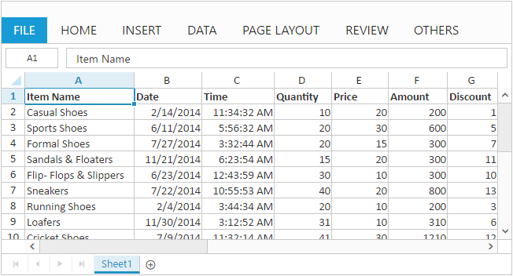

# Getting started

Before we start with the Spreadsheet, please refer [`this page`](http://help.syncfusion.com/js/angularjs) for general information regarding integrating Syncfusion widget's.
This section explains you the steps required to populate the Spreadsheet with data, format, and export it as excel file. This section covers only the minimal features that you need to know to get started with the Spreadsheet.

## Adding Script Reference

To render the Spreadsheet control, the following list of external dependencies are needed, 

* [jQuery](http://jquery.com) - 1.7.1 and later versions
* [Angular](https://angularjs.org/) - angular latest versions

The required angular script as `angular.min.js` and `ej.widget.angular.min.js` which can be available in below [CDN](/js/cdn) links:

* `angular.min.js` - [http://cdn.syncfusion.com/js/assets/external/angular.min.js](http://cdn.syncfusion.com/js/assets/external/angular.min.js)
* `ej.widget.angular.min.js` - [http://cdn.syncfusion.com/{{ site.releaseversion }}/js/common/ej.widget.angular.min.js](http://cdn.syncfusion.com/14.3.0.49/js/common/ej.widget.angular.min.js)

For other required internal dependencies refer the [`link`](http://help.syncfusion.com/angularjs/spreadsheet/dependencies "link")

N> Spreadsheet uses one or more sub-controls, therefore refer the `ej.web.all.min.js` (which encapsulates all the `ej` controls and frameworks in a single file) in the application instead of referring all the above specified internal dependencies. 

To get the real appearance of the Spreadsheet, the dependent CSS file `ej.web.all.min.css` (which includes styles of all the widgets) should also needs to be referred.

So the complete boilerplate code is



<!DOCTYPE html>
<html  ng-app="defaultApp">
<head>
   <!-- Essential Studio for JavaScript  theme reference -->
      <link rel="stylesheet" href="http://cdn.syncfusion.com/14.3.0.49/js/web/flat-azure/ej.web.all.min.css" />
   <!-- Essential Studio for JavaScript  script references -->   
      
      
      
      
      
      
      
      
 </head>
 <body>
 </body>
</html>



N> In production, we highly recommend you to use our [`custom script generator`](http://helpjs.syncfusion.com/js/custom-script-generator)  to create custom script file with required controls and its dependencies only. Also to reduce the file size further please use [`GZip compression`](https://developers.google.com/web/fundamentals/performance/optimizing-content-efficiency/optimize-encoding-and-transfer?hl=en) in your server.
N> For themes, you can use the `ej.web.all.min.css` CDN link from the code example given. To add the themes in your application, please refer to [`this link`](http://help.syncfusion.com/js/theming-in-essential-javascript-components).

## Initialize Spreadsheet

All the Essential JavaScript directives have been encapsulated into a single module called `ejangular` so the first step would be to declare dependency for this module within your AngularJS application. 

The Spreadsheet can be created using `ej-spreadsheet` AngularJS directive and its properties can be defined using `e-` prefix followed by the property name. 

The code example for defining controls in AngularJS is as follows,



<!DOCTYPE html>
<html ng-app="defaultApp">  
    <body ng-controller="SpreadsheetCtrl">
          

    </body>
</html>



The Spreadsheet is rendered based on `e-scrollsettings-width` and `e-scrollsettings-height` property.



<!DOCTYPE html>
<html>    
   <body>
      
    </body>
</html>



Now, the Spreadsheet is rendered with default row and column count.

## Populate Spreadsheet with data

Now, this section explains how to populate JSON data to the Spreadsheet. You can set `dataSource` property in `e-sheets` settings to populate JSON data in Spreadsheet.



<body ng-controller="SpreadsheetCtrl">
    

</body>
   
   


N> For more details about `data binding` refer following [`link`](http://help.syncfusion.com/angularjs/spreadsheet/data-binding "link")

## Apply Conditional Formatting

Conditional formatting helps you to apply formats to a cell or range with certain color based on the cells values. You can use `e-allowconditionalformats` property to enable/disable Conditional formats.

To apply conditional formats for a range use [`setCFRule`](http://help.syncfusion.com/api/js/ejspreadsheet#methods:xlcformat-setcfrule "setCFRule") method. The following code example illustrates this,



<body ng-controller="SpreadsheetCtrl">
    

</body>
   
   


N> For more details about `Conditional Formatting` refer following [`link`](http://help.syncfusion.com/angularjs/spreadsheet/data-presentation#conditional-formatting "link")

## Export Spreadsheet as Excel File

The Spreadsheet can save its data, style, format into an excel file. To enable save option in Spreadsheet set `e-exportsettings-allowexporting` option as `true`and Specify `e-exportsettings-excelUrl` option to save documents using server side helper. The following code example illustrates this,



<body ng-controller="SpreadsheetCtrl">
    

</body>



Use shortcut `Ctrl + S` to save Spreadsheet as excel file.

N> 1. For more details about `Export` refer following [`link`](http://help.syncfusion.com/angularjs/spreadsheet/open-and-save#save "link")
N> 2. For more details about `Server Configuration` refer following [`link`](http://help.syncfusion.com/angularjs/spreadsheet/open-and-save#server-configuration "link")
