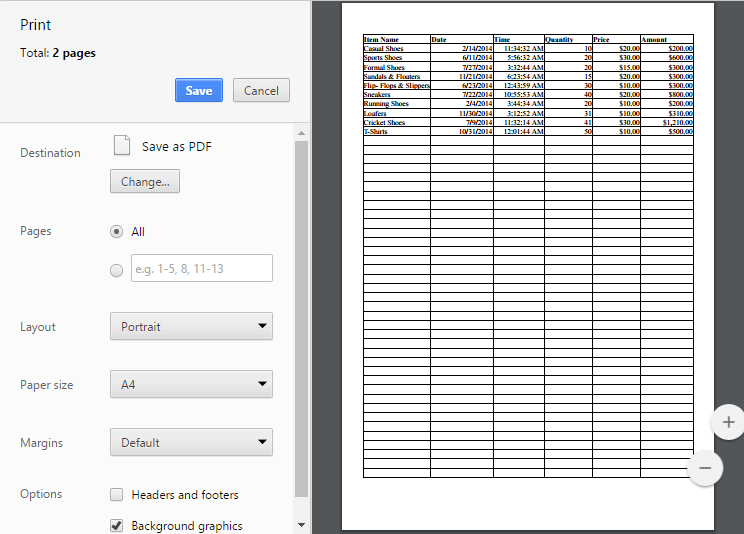

# Print

This feature is used for produce text and graphics from a computer screen or file onto a sheet of paper. You can use `allowprinting` property in `e-printsettings` to enable/disable the print operation.

You have following options in printing.

* Print Sheet / Print Selected Area.
* Print with Gridlines
* Print with Headers

## Print Sheet / Print Selected Area

You can print the sheet or print the selected area by following ways,

* Using the Print button or Print Selected button under Print group of PAGE LAYOUT tab in ribbon.
* Using [`printSheet`](https://help.syncfusion.com/api/js/ejspreadsheet#methods:xlprint-printsheet "printSheet") or [`printSelection`](https://help.syncfusion.com/api/js/ejspreadsheet#methods:xlprint-printselection "printSelection") method to print the spreadsheet.

The following code example describes the above behavior.


<body ng-controller="SpreadsheetCtrl">
<button id="btnPrint" ej-button e-showroundedcorner="true" e-click="printClick" e-width="80">Print</button>
<button id="btnPrintSel" ej-button e-showroundedcorner="true" e-click="printSelClick">Print Selected</button>

</body>



var syncApp = angular.module("defaultApp", ["ngRoute", "ejangular"]);
// the datasource "window.defaultData" is referred from 'http://js.syncfusion.com/demos/web/scripts/xljsondata.min.js'
     syncApp.controller('SpreadsheetCtrl', function ($scope,$rootScope) {
         $scope.sheetData = [{
                rangeSettings: [{ dataSource: window.defaultData }],
            }];
            $scope.printClick = printClick;
            $scope.printSelClick = printSelClick;
     });
function printClick(args) {
    var xlObj = $("#Spreadsheet").ejSpreadsheet("instance");
    xlObj.XLPrint.printSheet();
}
function printSelClick(args) {
    var xlObj = $("#Spreadsheet").ejSpreadsheet("instance");
    xlObj.XLPrint.printSelection();
}


The following output is displayed as a result of the above code example.

Print dialog with entire sheet in Chrome browser
{:.caption}

Print dialog with selected area print in chrome browser
{:.caption}

## Print with Gridlines

You have an option to print the spreadsheet with gridlines or without gridlines. You can do this by one of the following ways,

* Check the Gridlines option under Show group of PAGE LAYOUT tab in ribbon to print with Gridlines.
* Using `showGridlines` property to enable / disable the gridlines.

The following code example describes the above behavior.


<body ng-controller="SpreadsheetCtrl">
     

</body>



var syncApp = angular.module("defaultApp", ["ngRoute", "ejangular"]);
// the datasource "window.defaultData" is referred from 'http://js.syncfusion.com/demos/web/scripts/xljsondata.min.js'
     syncApp.controller('SpreadsheetCtrl', function ($scope,$rootScope) {
         $scope.sheetData = [{
                rangeSettings: [{ dataSource: window.defaultData }],
                  showGridlines: false
            }];
     });


Print dialog without gridlines in chrome browser
{:.caption}

## Print with Headings

You have an option to print the spreadsheet with gridlines or without headers. You can do this by one of the following ways,

* Check the Headings option under Show group of PAGE LAYOUT tab in ribbon. 
* Using `showHeadings` property to enable / disable headings.

The following code example describes the above behavior.


<body ng-controller="SpreadsheetCtrl">
     

</body>



var syncApp = angular.module("defaultApp", ["ngRoute", "ejangular"]);
// the datasource "window.defaultData" is referred from 'http://js.syncfusion.com/demos/web/scripts/xljsondata.min.js'
     syncApp.controller('SpreadsheetCtrl', function ($scope,$rootScope) {
         $scope.sheetData = [{
                rangeSettings: [{ dataSource: window.defaultData }],
                  showHeadings: false
            }];
     });


Print dialog without headings in chrome browser
{:.caption}
