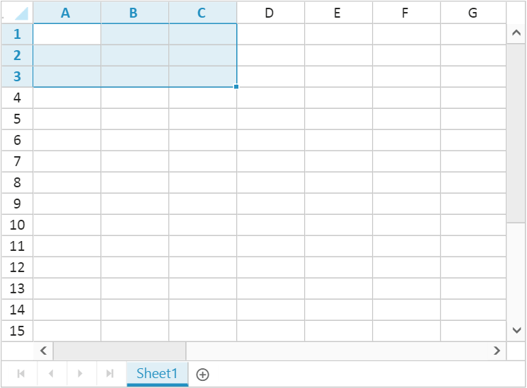
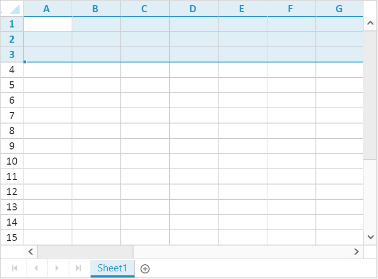
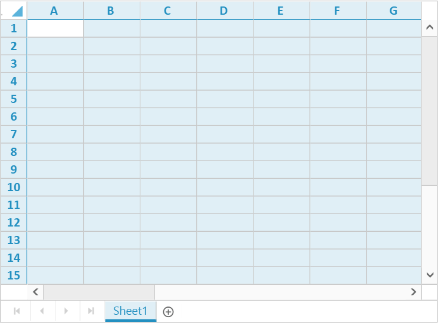

# Selection

Selection provides an interactive support to highlight cell, row, or column that you select. Selection can be done through Mouse, Touch or Keyboard interaction. To enable selection, set `e-allowselection` as `true`.

## Selection Modes

The mode of selection can be single or range selection. The default selection mode can be set using `selectionunit` in `e-selectionsettings`.
The two types of selection mode are as follows,

* Single - `ej.Spreadsheet.SelectionUnit.Single`
* Range - `ej.Spreadsheet.SelectionUnit.Range`

## Selection Type

There are four types of selection in Spreadsheet,

1. Cell Selection
2. Row Selection
3. Column Selection
4. Sheet Selection

You can set default `selectiontype` in `e-selectionsettings`.

### Cell Selection 

Cell selection is used to select a single or multiple cells. It can be performed using [`selectRange`](http://help.syncfusion.com/api/js/ejspreadsheet#methods:xlselection-selectrange "selectRange") method. 
The following code example describes the above behavior,



<body ng-controller="SpreadsheetCtrl">
     

</body> 



var syncApp = angular.module("defaultApp", ["ngRoute", "ejangular"]);
    syncApp.controller('SpreadsheetCtrl', function ($scope,$rootScope) {
         $scope.selectionunit = ej.Spreadsheet.SelectionUnit.Range;
         $scope.loadComplete = loadComplete;
    });

function loadComplete() {
    this.XLSelection.selectRange("A1:C3");
    this.XLDragFill.positionAutoFillElement();
}



The following output is displayed as a result of the above code example.

### Row Selection 

Row selection is used to select a single or multiple rows. It can be performed using [`selectRows`](http://help.syncfusion.com/api/js/ejspreadsheet#methods:xlselection-selectrows "selectRows") method.
The following code example describes the above behavior,



<body ng-controller="SpreadsheetCtrl">
     

</body> 



var syncApp = angular.module("defaultApp", ["ngRoute", "ejangular"]);
    syncApp.controller('SpreadsheetCtrl', function ($scope,$rootScope) {
         $scope.loadComplete = loadComplete;
    });
function loadComplete() {
    this.XLSelection.selectRows(0,2);
    this.XLDragFill.positionAutoFillElement();
}



The following output is displayed as a result of the above code example.

N> This type can be set as default by setting `selectiontype` property in `e-selectionsettings` as `ej.Spreadsheet.SelectionType.Row`

### Column Selection

Column selection is used to select a single or multiple columns. It can be performed using [`selectColumns`](http://help.syncfusion.com/api/js/ejspreadsheet#methods:xlselection-selectcolumns "selectColumns") method.
The following code example describes the above behavior,



<body ng-controller="SpreadsheetCtrl">
     

</body> 



var syncApp = angular.module("defaultApp", ["ngRoute", "ejangular"]);
    syncApp.controller('SpreadsheetCtrl', function ($scope,$rootScope) {
         $scope.loadComplete = loadComplete;
    });
function loadComplete() {
    this.XLSelection.selectColumns(0,2);
    this.XLDragFill.positionAutoFillElement();
}



The following output is displayed as a result of the above code example.

N> This type can be set as default by setting `selectiontype` property in `e-selectionsettings`as `ej.Spreadsheet.SelectionType.Column`

### Sheet Selection

Sheet selection is used to select all cells in a worksheet.  It can be performed using [`selectSheet`](http://help.syncfusion.com/api/js/ejspreadsheet#methods:xlselection-selectsheet "selectSheet") method.
The following code example describes the above behavior,



<body ng-controller="SpreadsheetCtrl">
     

</body> 



var syncApp = angular.module("defaultApp", ["ngRoute", "ejangular"]);
    syncApp.controller('SpreadsheetCtrl', function ($scope,$rootScope) {
         $scope.loadComplete = loadComplete;
    });
function loadComplete() {
    this.XLSelection.selectSheet();    
}



The following output is displayed as a result of the above code example. 
