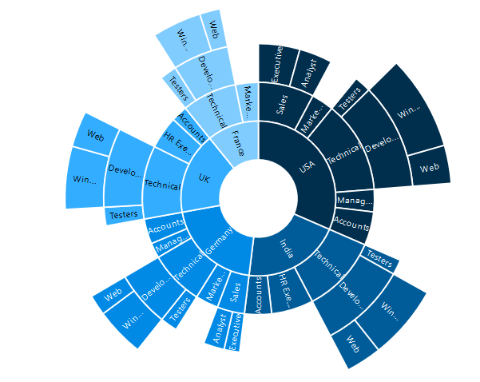

# Appearance
The appearance of the Sunburst Chart can be customized as shown below 

## Palette
The Sunburst Chart displays different segments in different colors by default. You can customize the color of each segment by providing a custom color palette of your choice by using the **e-palette** property.



<html xmlns="http://www.w3.org/1999/xhtml" lang="en" ng-app="SunburstChartApp">
    <head>
        <title>Essential Studio for AngularJS: Chart</title>
        <!--CSS and Script file References -->
    </head>
    <body ng-controller="SunburstChartCtrl">
        

        

        
    </body>
</html>



The Sunburst Chart rendered with palette colors

 
## Built- in Themes

The Sunburst Chart supports different themes. 

*	flat-light
*	flat-dark
*	gradient-light
*	gradient-dark
*	azure
*	azure-dark
*	lime
*	lime-dark
*	saffron
*	saffron-dark
*	gradient-azure
*	gradient-azure-dark
*	gradient-lime
*	gradient-lime-dark
*	gradient-saffron
*	gradient-saffron-dark

You can set your desired theme by using the **e-theme** property. **Flat light** is the default theme used in the Sunburst Chart.



					



