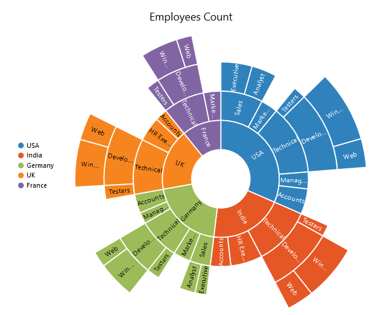

# Getting Started

Before we start with the Chart, please refer [this page](http://help.syncfusion.com/js/angularjs)  for general information regarding integrating Syncfusion widget’s.

## Adding script reference

To render the SunburstChart control, the following list of external dependencies are needed, 

* [jQuery](http://jquery.com) - 1.7.1 and later versions
* [Angular](https://angularjs.org/) - angular latest versions

The required angular script as `angular.min.js` and `ej.widget.angular.min.js` which can be available in below [CDN](/js/cdn) links:

* `angular.min.js` - [http://cdn.syncfusion.com/js/assets/external/angular.min.js](http://cdn.syncfusion.com/js/assets/external/angular.min.js)
* `ej.widget.angular.min.js` - [http://cdn.syncfusion.com/{{ site.releaseversion }}/js/common/ej.widget.angular.min.js](http://cdn.syncfusion.com/14.3.0.49/js/common/ej.widget.angular.min.js)

The other required internal dependencies are tabulated below,

<table>
   <tr>
      <th>
         <b>Files</b>
      </th>
      <th>
         <b>Description/Usage </b>
      </th>
   </tr>
   <tr>
      <td>
         ej.core.min.js
      </td>
      <td>
        It is referred always before using all the JS controls.
      </td>
   </tr>
   <tr>
      <td>
         ej.data.min.js
      </td>
      <td>
         Used to handle data operation and is used while binding data to the JS controls.
      </td>
   </tr>
   <tr>
      <td>
        ej.sunburstchart.min.js
      </td>
      <td>
        Sunburst Chart core script file which includes chart related scripts files.
      </td>
   </tr>
   </table>

N> Refer the `ej.web.all.min.js` (which encapsulates all the `ej` controls and frameworks in a single file) in the application instead of referring all the above specified internal dependencies. 

So the complete boilerplate code is



 <!DOCTYPE html>
    <html xmlns="http://www.w3.org/1999/xhtml" lang="en" ng-app="syncApp">
    <head>
    <title>Essential Studio for AngularJS: Chart</title>
    <!-- Essential Studio for JavaScript  theme reference -->
    <link href="http://cdn.syncfusion.com/{{ site.releaseversion }}/js/web/flat-azure/ej.web.all.min.css" rel="stylesheet" />
    <!-- Essential Studio for JavaScript  script references -->
    
    
        
    
    
    <!-- Add your custom scripts here -->
    </head>
    <body>
    </body>
    </html>



N> 1. In production, we highly recommend you to use our [`custom script generator`](http://help.syncfusion.com/js/custom-script-generator) to create custom script file with required controls and its dependencies only. Also to reduce the file size further please use [`GZip compression`](https://developers.google.com/web/fundamentals/performance/optimizing-content-efficiency/optimize-encoding-and-transfer?hl=en) in your server.
N> 2. For themes, you can use the `ej.web.all.min.css` CDN link from the code snippet given. To add the themes in your application, please refer to [`this link`](http://help.syncfusion.com/js/theming-in-essential-javascript-components).

## Initialize Sunburst Chart

1. Add a **div** element that acts as a container for **e-ejsunburstchart**.



<html>
<body>
    

</body>
</html>



## Populate Data source:
The datasource for the Sunburst Chart is populated as a JSON object. The “default_data” contains the JSON data for rendering the Sunburst Chart as shown in the sample.



var default_data = [

{ Category: "Employees", Country: "USA", JobDescription: "Sales", JobGroup: "Executive", EmployeesCount: 50 },
{ Category: "Employees", Country: "USA", JobDescription: "Sales", JobGroup: "Analyst", EmployeesCount: 40 },
{ Category: "Employees", Country: "USA", JobDescription: "Marketing", EmployeesCount: 40 },
{ Category: "Employees", Country: "USA", JobDescription: "Technical", JobGroup: "Testers", EmployeesCount: 55 },
{ Category: "Employees", Country: "USA", JobDescription: "Technical", JobGroup: "Developers", JobRole: "Windows", EmployeesCount: 175 },
{ Category: "Employees", Country: "USA", JobDescription: "Technical", JobGroup: "Developers", JobRole: "Web", EmployeesCount: 70 },
{ Category: "Employees", Country: "USA", JobDescription: "Management", EmployeesCount: 40 },
{ Category: "Employees", Country: "USA", JobDescription: "Accounts", EmployeesCount: 60 },

{ Category: "Employees", Country: "India", JobDescription: "Technical", JobGroup: "Testers", EmployeesCount: 43 },
{ Category: "Employees", Country: "India", JobDescription: "Technical", JobGroup: "Developers", JobRole: "Windows", EmployeesCount: 125 },
{ Category: "Employees", Country: "India", JobDescription: "Technical", JobGroup: "Developers", JobRole: "Web", EmployeesCount: 60 },
{ Category: "Employees", Country: "India", JobDescription: "HR Executives", EmployeesCount: 70 },
{ Category: "Employees", Country: "India", JobDescription: "Accounts", EmployeesCount: 45 },

{ Category: "Employees", Country: "Germany", JobDescription: "Sales", JobGroup: "Executive", EmployeesCount: 30 },
{ Category: "Employees", Country: "Germany", JobDescription: "Sales", JobGroup: "Analyst", EmployeesCount: 40 },
{ Category: "Employees", Country: "Germany", JobDescription: "Marketing", EmployeesCount: 50 },
{ Category: "Employees", Country: "Germany", JobDescription: "Technical", JobGroup: "Testers", EmployeesCount: 40 },
{ Category: "Employees", Country: "Germany", JobDescription: "Technical", JobGroup: "Developers", JobRole: "Windows", EmployeesCount: 65 },
{ Category: "Employees", Country: "Germany", JobDescription: "Technical", JobGroup: "Developers", JobRole: "Web", EmployeesCount: 27 },
{ Category: "Employees", Country: "Germany", JobDescription: "Management", EmployeesCount: 33 },
{ Category: "Employees", Country: "Germany", JobDescription: "Accounts", EmployeesCount: 55 },

{ Category: "Employees", Country: "UK", JobDescription: "Technical", JobGroup: "Testers", EmployeesCount: 45 },
{ Category: "Employees", Country: "UK", JobDescription: "Technical", JobGroup: "Developers", JobRole: "Windows", EmployeesCount: 96 },
{ Category: "Employees", Country: "UK", JobDescription: "Technical", JobGroup: "Developers", JobRole: "Web", EmployeesCount: 55 },
{ Category: "Employees", Country: "UK", JobDescription: "HR Executives", EmployeesCount: 60 },
{ Category: "Employees", Country: "UK", JobDescription: "Accounts", EmployeesCount: 30 },

{ Category: "Employees", Country: "France", JobDescription: "Technical", JobGroup: "Testers", EmployeesCount: 40 },
{ Category: "Employees", Country: "France", JobDescription: "Technical", JobGroup: "Developers", JobRole: "Windows", EmployeesCount: 65 },
{ Category: "Employees", Country: "France", JobDescription: "Technical", JobGroup: "Developers", JobRole: "Web", EmployeesCount: 27 },
{ Category: "Employees", Country: "France", JobDescription: "Marketing", EmployeesCount: 50 }

 ];



### Initialize Sunburst Chart with data
Now, bind the default_Datasource to `datasource` property of the Sunburst Chart. The`levels`property determines the number of hierarchical levels. Each hierarchy level is formed based on the property specified in `groupMemberPath` property, and each arc segment size is calculated using `valueMemberPath`.

2. Add a script tag anywhere in the web page and add the following code.



					

       

</script>



3. The final HTML file appears as follows



<html xmlns="http://www.w3.org/1999/xhtml">
      <head>
        <title></title>
       <!--  jquery script  -->
        
    
        <!-- Essential JS UI widget -->
        
       
        <!-- Essential JS theme -->
        

        <!-- SunburstData -->
        
      </head>
    <body>
    	  
      

    

              
    </body>
    </html>



## Add Title to the Sunburst Chart

The title of the Sunburst chart is used to provide quick information to the user about the data being plotted in the Sunburst Chart. You can add it by using the `text` property of the `e-title` 



 
					



## Enable Legend

You can enable or disable the legend by using the `visible` property present inside the `e-legend`



 
					



## Add Data Labels

The data labels are used to improve the readability of the Sunburst chart. This can be achieved by enabling the `visible` property in the `e-datalabelsettings`



 
					



Now the Sunburst Chart is rendered along with the specified customizations

[Click](http://ngjq.syncfusion.com/#/sunburstchart/default) here to view the default sample of the SunburstChart 
