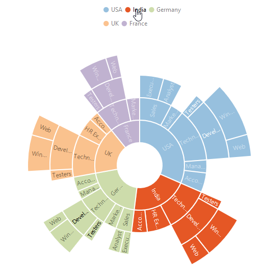

## Legend
The legend is used to represent the first level of items in the Sunburst Chart.The `legend` can be initialized using the below code snippet



					

 

## Legend Icon 

You can specify different shapes of legend icon by using the `e-legend-shape` property of the legend. By default, legend shape is **Circle**. The Sunburst chart has some predefined shapes such as:
* Circle
* Cross
* Diamond
* Pentagon
* Rectangle
* Triangle



					



 
## Positioning the Legend

By using the `position` property, you can position the legend at left, right, top or bottom of the chart. 



					



 
### Customization

## Legend Item Size and border
You can change the size of the legend items by using the `e-legend-itemStyle-width` and `e-legend-itemStyle-height` property. To change the legend item border, use `e-legend-border`property of the legend .



					



## Legend Alignment

You can align the legend to the `center`, `far` or `near` based on its position by using the `e-legend-alignment` option.





## Legend Size

By default, legend takes 20% of the height horizontally when it was placed on the top or bottom position and 20% of the width vertically while placing on the left or right position of the chart. You can change this default legend size by using the `e-legend-size` property of the legend.



					



 

## Legend Row and Column

You can arrange the legend items horizontally and vertically by using the `e-legend-rowCount` and `e-legend-columnCount` properties of the legend.
•	When only the rowCount is specified, the legend items are arranged according to the rowCount and number of columns may vary based on the number of legend items.
•	When only the columnCount is specified, the legend items are arranged according to the columnCount and number of rows may vary based on the number of legend items.
•	When both the properties are specified, then the one which has higher value is given preference. For example, when the rowCount is 4 and columnCount is 3, legend items are arranged in 4 rows.
•	When both the properties are specified and have the same value, the preference is given to the columnCount when it is positioned at the top/bottom position. The preference is given to the rowCount when it is positioned at the left/right position.
 


					



## Legend Item Padding

You can control the spacing between the legend items by using the `e-legend-itemPadding` option of the legend.

 


					



 
## LegendInteractivity

You can select a specific category while clicking on corresponding legend item through `e-legend-clickAction` property. 

It has three types of action
*	ToggleSegmentSelection
*	ToggleSegmentVisibility
*	None

## ToggleSegmentSelection

Used to highlight specific category while clicking on legend item



					



 
## Toggle Segment Visibility

Used to disable the specific category while clicking on legend item.



					



## Legend title

To add the title to the legend, you have to specify the e-legend-title-text option.



					



## Customize the legend text

To customize the legend item text and title you can use the `e-legend-title-font` and `e-legend-title` options. You can change the legend title alignment by using the `e-legend-title-textAlignment` option of the legend title.



					


