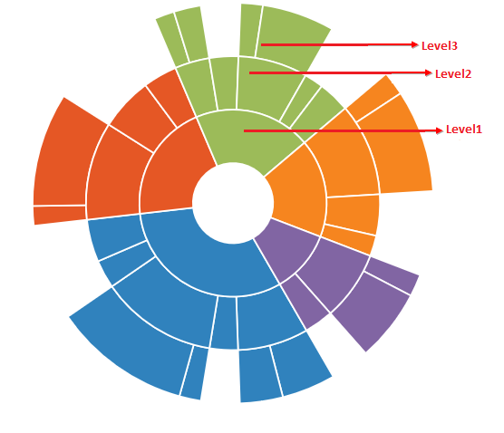

## Levels

Sunburst chart is used to display hierarchical data. You can add more than one hierarchical data by using the `e-levels` property of Sunburst chart. Each level of the hierarchy is represented by circle.
The following code snippet illustrates 



     



## GroupMemberPath

It is the string property that is used to map the group category value in the dataSource .
You can define the levels as shown in the below code example



 

 

 



The following screenshot illustrates the Sunburst Chart with different levels

