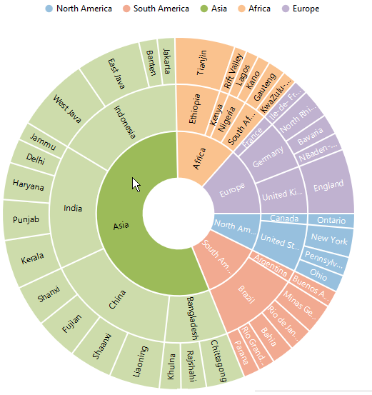
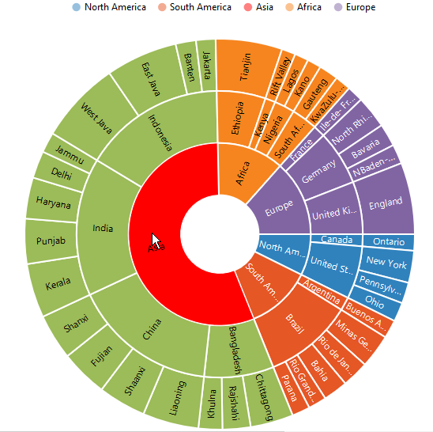
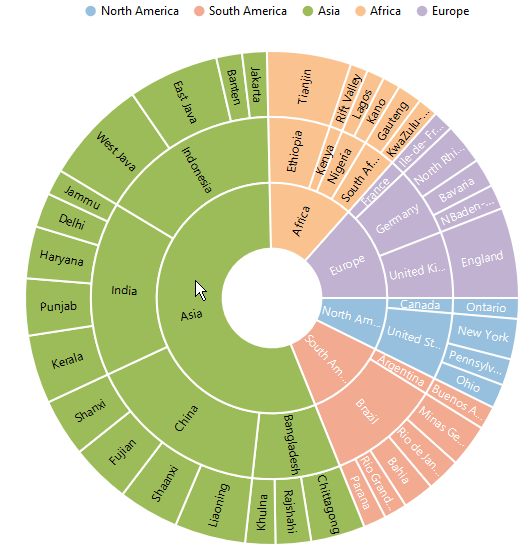
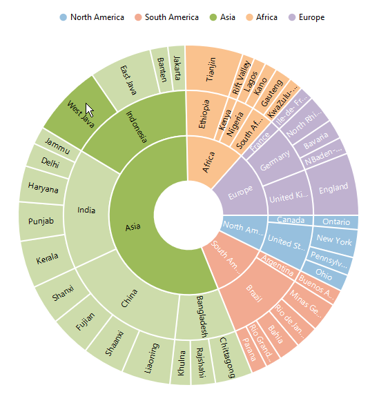
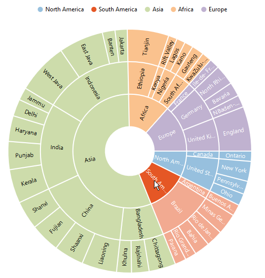
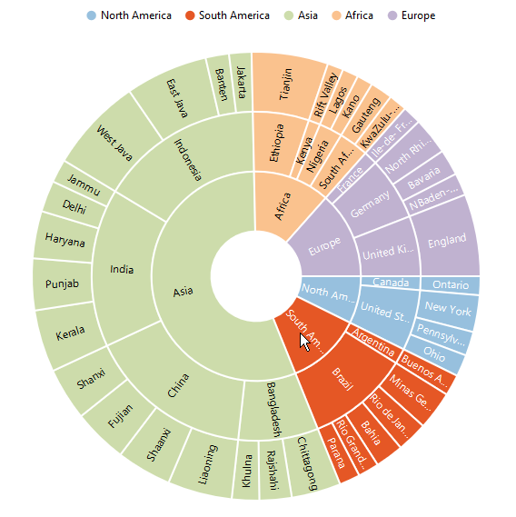

# Selection 

SunburstChart provides selection support for the points on mouse click. To enable the selection , set the `e-selectionsettings-enable` property to true in the `e-selectionsettings`. 



					



 
## Selection Display mode

 You can customize the selected  segment appearance by using *color or opacity*. You can choose between color or opacity using the `e-selectionsettings-type` property in the selection Settings.

*	selectionByColor – To display the selected segment appearance using color.
*	selectionByOpacity – To display the selected segment appearance using opacity.



 

## Selection Mode

Sunburst chart provides multiple option to represent the selected categories. You can select the segment categories by using the `e-selectionsettings-mode` property in selectionSettings
*	Child – To selection the child of selected parent.
*	All – To selection the entire categories in group.
*	Parent – To selection the parent of selected child.
*	Single - To selection single item in the category.

### Child
The following code shows how to set the selection type as child 



					



 
### Parent

The parent mode can be enabled by using the below code 



					



 
### Point

To selection the particular segment, the point mode of the selection settings is used.



					

 

 
### All

The following code snippet is used for the all mode of selection settings



					



[Click](http://ngjq.syncfusion.com/#/sunburstchart/selection) here to view the online demo sample of Selection in  the Sunburst Chart.
