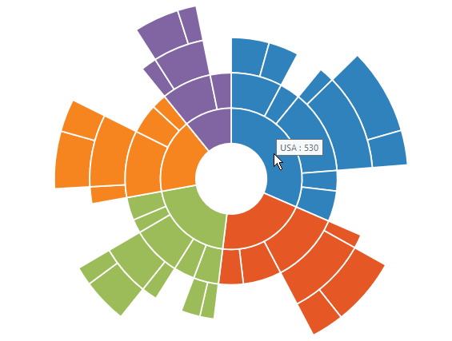
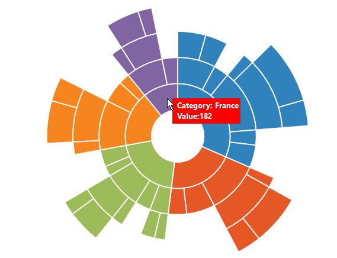

## Tooltip  

ToolTip allows you to display any information over a sunburst segment. It appears when mouse hovered over or touch any chart segment. By default, it displays the corresponding segment category name and its value



					



## Tooltip Template   

HTML elements can be displayed in the tooltip by using the `e-tooltip-template` property of the tooltip. The template property takes the value of the id attribute of the HTML element. You can use the **#point.x#** and **#point.y#** as place holders in the HTML element to display the x and y values of the corresponding point.

You can add a 
 element to set the `background` for the Sunburst chart and attach the styles to the HTML page such as height and  width.



        

            

                <label id="efpercentage" style="color:white">
                    &nbsp;&nbsp;Category:&nbsp;#point.x#
                    &nbsp;&nbsp;Value:#point.y#
                </label>
            

        

    

					



## Customize the appearance of tooltip

The fill and border options are used to customize the background color and border of the tooltip respectively. The font option in the tooltip is used to customize the font of the tooltip text.



		

