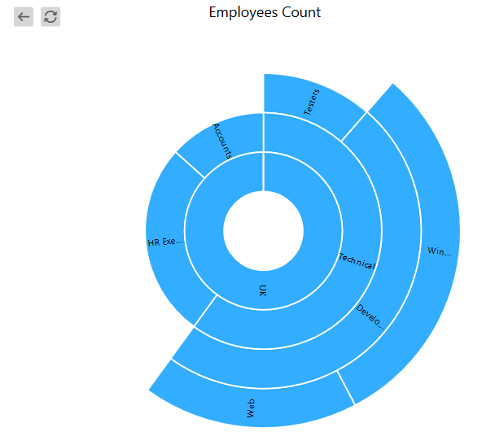

# Zooming

Sunburst chart provides zooming (drill down) experience with animation for both mouse and touch enabled devices. It allows you to Virtualize large sets of data into minimum data view.The zooming is achieved by using the property of `e-zoomsettings`

The following code shows how to initialize the zooming.



					



## Zooming toolbar

By default, zooming toolbar will be enabled while zooming the segment.It contains both back and reset option.
You can align the zooming toolbar position by using `e-zoomsettings-toolbarHorizontalAlignment` and `e-zoomsettings-toolbarVerticalAlignment` property.



 					



[Click](http://ngjq.syncfusion.com/#/sunburstchart/zooming) here to view the online demo sample of Zooming in the Sunburst Chart.
