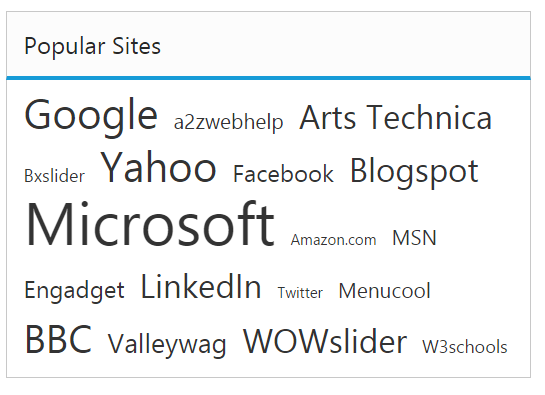

# Data-Binding

To render the **TagCloud** widget, it is necessary to bind the data to it in a proper way. The following sub-properties provides you a way to bind local or remote data to the **TagCloud** widget by binding the appropriate data fields to the corresponding options.

## Fields 

### dataSource 

This property assigns the local **JSON** data or remote (URL binding) data to the **TagCloud** control.

### query 

It accepts the data of object type that is usually the query string to fetch the required data from a specific table based on certain conditions. As this property is optional, when it is not specified, then the entire records that are initially assigned through dataSource is taken into consideration.

### text

It maps the corresponding text field name from the data table or **JSON** data that is assigned to the dataSource with the text property of the **TagCloud** control. The text value that is fetched from the table renders the value to be displayed in the **TagCloud**.

### URL

URL field in the data table or **JSON** data assigned the datasource is mapped to the URL property of the **TagCloud** control. The URL property defines the link to be navigated on clicking the corresponding text item.

### frequency

It maps to the frequency field name from the data table or **JSON** data that is assigned to the dataSource. The frequency value that is fetched from the table should be a number to categorize the font size.

In data binding concept of TagCloud control, need to set the fields using two way binding that is you need to assign the values of the fields using scope variable.

The following example depicts you the way to bind data to the **TagCloud** widget,



<body ng-controller="TagCloudCtrl" style="padding:20px">
    

        

    

    

</body>



The following screenshot illustrates a **TagCloud** control using AngularJS data binding,

