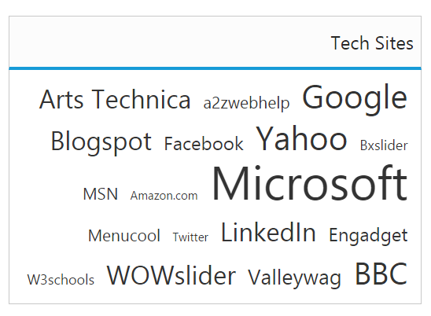

# RTL Support

This feature supports you to change the left-to-right alignment of the **TagCloud** widget to right-to-left (RTL). This displays the content from right-to-left in the widget. You can achieve this using [enableRTL](https://help.syncfusion.com/api/js/ejtagcloud#members:enablertl) property that is set false by default.

## Enabling RTL Support

The following steps explains you the enabling of right-to-left property in **TagCloud**.

Refer to the below code to renderTagCloud in RTL.



 





var list = [
    { text: "Google", url: "http://www.google.co.in", frequency: 12 },
    { text: "a2zwebhelp", url: "http://www.a2zwebhelp.com", frequency: 3 },
    { text: "Arts Technica", url: "http://arstechnica.com/", frequency: 8 },
    { text: "BBC", url: "http://www.bbc.co.uk/", frequency: 11 },
    { text: "Valleywag", url: "http://valleywag.gawker.com/", frequency: 6 },
    { text: "WOWslider", url: "http://wowslider.com", frequency: 9 },
    { text: "W3schools", url: "http://www.w3schools.com/", frequency: 2 }
];
angular.module('tagCloudApp', ['ejangular'])
.controller('TagCloudCtrl', function ($scope) {
    $scope.dataList = list;
});



The following screenshot illustrates the **TagCloud** control with RTL support.

