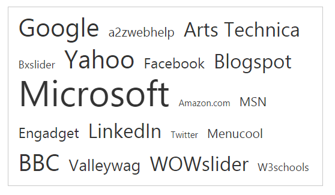
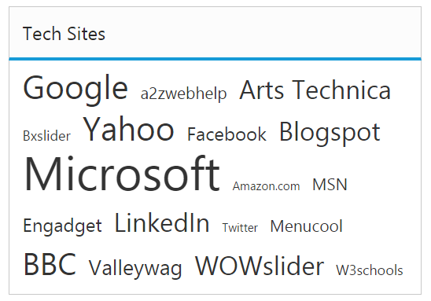
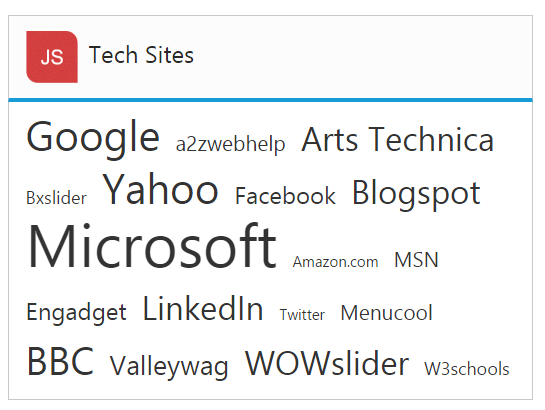

# Title Customization

## Show title

The **TagCloud** items are displayed with a Title element by default. To hide the title, you can use [showTitle](https://help.syncfusion.com/api/js/ejtagcloud#members:showtitle) property that is true by default.

### How to disable title in TagCloud

Refer to the below code to disable the title in tagcloud.



 



The following screenshot illustrates a **TagCloud** control when you disable title,

 

## Title text

**TagCloud** widget allows you to set a custom title text by using the [titleText](https://help.syncfusion.com/api/js/ejtagcloud#members:titletext) property. By default titleText property is set to string value "Title".

### Defining title text for TagCloud

The following steps explains you on how to configure **titleText** for a **TagCloud**.

Refer to the below code to define the title in tagcloud.



 





angular.module('tagCloudApp', ['ejangular'])
.controller('TagCloudCtrl', function ($scope) {
    $scope.title = "Tech Sites";
});



The following screenshot illustrates the **TagCloud** control with customized title text.

## Title image

**TagCloud** widget provides **titleImage** to set an image for the title. You can set the desired image **URL** to [titleImage](https://help.syncfusion.com/api/js/ejtagcloud#members:titleimage) property.

### Defining title text for TagCloud

The following steps explains you to configure **titleImage** for a **TagCloud**.

Refer to the below code to configure the title image in tagcloud.







var list = [
{ text: "Google", url: "http://www.google.co.in", frequency: 12 },
    { text: "a2zwebhelp", url: "http://www.a2zwebhelp.com", frequency: 3 },
    { text: "Arts Technica", url: "http://arstechnica.com/", frequency: 8 },
    { text: "slider", url: "http://bxslider.com/examples", frequency: 2 },
    { text: "Yahoo", url: "http://in.yahoo.com/", frequency: 12 },
    { text: "W3schools", url: "http://www.w3schools.com/", frequency: 2 }
];
angular.module('tagCloudApp', ['ejangular'])
.controller('TagCloudCtrl', function ($scope) {
    $scope.title = "Tech Sites";
    $scope.dataList = list;
    $scope.image = "http://js.syncfusion.com/demos/web/images/waitingpopup/js_logo.png";
});



Using CSS class you can resize the image content as follows.





The following screenshot illustrates the **TagCloud** control with customized title image.

